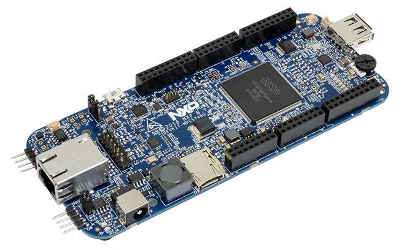

// See https://isis.apache.org/guides/dg/resources/asciidoc-writers-guide.pdf
= DEVKIT-MPC5748G -- Open Source Toolchain Support for a low-cost multi-core PowerPC Evaluation Board
:Author:            Peter Vranken
:Email:             mailto:Peter_Vranken@Yahoo.de
:toc:               left
//:toclevels:         3
//:numbered:
//:xrefstyle:         short
//:sectanchors:       // Have URLs for chapters (http://.../#section-name)
:icons:             font
:caution-caption:   :fire:
:important-caption: :exclamation:
:note-caption:      :paperclip:
:tip-caption:       :bulb:
:warning-caption:   :warning:

== Introduction

This project aims at supporting the software development for the NXP PowerPC
microcontroller MPC5748G with professional yet free of charge software
development tools. It's not difficult to find a GNU C cross compiler for the
PowerPC architecture in the Internet but as a matter of experience it's
quite cumbersome to make it produce a flashable and running piece of code.
Furthermore, if we have produced such a binary file then it's still
another matter to flash it and to find and setup a debugger to step through
it.

.The NXP evaluation board DEVKIT-MPC5748G

None of these tasks can be solved in general. There are too many
dependencies on the host machine, the tool revisions, the specific chip
from the PowerPC family and the hardware board it is mounted on. Any
imaginable configuration of these will need particular investigation and
specific solutions. This project focuses on a single such configuration
and offers a clean, professional level solution for that one. It might be
possible or not possible, more or less difficult or more or less effortful
to migrate this solution to other revisions or ports of GCC or other
derivates from the microcontroller family but this is considered your
responsibility and out of scope of this project.

An important exception is the choice of the host machine. We don't expect
problems with Linux. GCC is anyway a native UNIX tool, Cygwin is obsolete
by nature, the NXP S32 Design Studio for Power Architecture (S32DS) is
available for Linux, too, and the makefiles used in this project have been
designed to run under Linux. Please note, that this has not been tested
yet.

The configuration for this project is:

[frame="none",options="noheader",width="100%",cols="1,2"]
|=======
|Microcontroller|https://www.nxp.com/products/processors-and-microcontrollers/power-architecture/mpc55xx-5xxx-mcus/ultra-reliable-mpc57xx-mcus/ultra-reliable-mcus-for-automotive-and-industrial-control-and-gateway:MPC574xB-C-G[NXP PowerPC MPC5748G]
|Evaluation board|https://www.nxp.com/design/development-boards/automotive-development-platforms/mpc57xx-mcu-platforms/mpc5748g-development-board-for-secure-gateway:DEVKIT-MPC5748G[NXP DEVKIT-MPC5748G]
|Host|Windows 10
|C compiler footnote:[
  The same compiler is element of the NXP S32 Design Studio installation. You don't need to download the compiler separately.]|https://drive.google.com/open?id=0B_3zBh2c7LroNEFIOVlJcUVKRWc[MinGW-powerpc-eabivle-4.9.4]
|IDE|https://www.nxp.com/design/software/development-software/s32-design-studio-ide/s32-design-studio-for-power-architecture:S32DS-PA[NXP S32 Design Studio for Power Architecture v2.1]
|Flash tool|(GNU debugger contained in S32 Design Studio)
|Debugger|(same as flash tool)
|Unix tools|(contained in S32 Design Studio)
|=======

The project presents a few code samples for this hardware and toolchain
configuration. The samples are intended to support your software
development. They are no fully elaborated, functional applications but
they offer high quality building blocks for a true application. The next
section gives an overview.

== The samples

=== startup

The most prominent embedded sample is the blinking LED, called
https://github.com/PeterVranken/DEVKIT-MPC5748G/tree/master/samples/startup["startup"]
in this project. While it is not of any use as such it does contain a lot
of reusable stuff for real development: As there is the toolchain setup
(compiler, linker, flash tool, debugger), a powerful, generic, fully
reusable makefile and a clean piece of startup code, which will suffice
for most applications. Remove the demo code from the three core's main
functions and start writing your application but don't loose time with
setting up your development environment.

Sample "startup" already integrates some reusable I/O drivers:

Simple but useful for your first steps is the I/O driver to access the
user LED's and buttons on the DEVKIT-MPC5748G. Evidently, this driver is
board specific, but the others aren't.

Most useful is the DMA based serial I/O driver, which connects the C
library's printf function family with the virtual COM port, that is
element of the board's USB connection. The S32 Design Studio comes along
with a suitable terminal software; just run a terminal application and
open the COM port of the evaluation board to display the printed output on
the host machine.

The System Timer Module driver (STM) can be used to measure time spans and
to add timing control to your software.

A driver for the Decorated Memory Storage Controller provides safe
core-to-core data exchange and an encapsulating and abstracting mutex
class further supports this.

The use of these I/O drivers is demonstrated by the code. All three cores
communicate with one another, considering and handling both, cache
coherency aspects and race conditions.

=== image:samples/safe-RTOS/doc/manual/theme/iconSafeRTOS-asColoredIcon.jpg[width="3%", pdfwidth="5%"] safe-RTOS

https://github.com/PeterVranken/DEVKIT-MPC5748G/tree/master/samples/safe-RTOS["safe-RTOS"]
is a technically ISO 26262 compliant RTOS with a process and privileges
management concept that implements the _freedom-from-interference_
paradigm. It can be run on one or more cores. If a core decides not to run
the RTOS then it can still make use of some low-level communication
services to safely exchange data across core-boundaries.

In this sample, the I/O drivers found in sample "startup" are further
elaborated in order to meet the demands of the kernel (safety aspects).

=== CAN

Sample application
https://github.com/PeterVranken/DEVKIT-MPC5748G/tree/master/samples/CAN["CAN"]
presents a CAN driver, which supports up to eight CAN devices. One of them
is externally connected to a transceiver and a connector. Connect your CAN
equipment to connector P5 of the DEVKIT-MPC5748G and try the CAN
communication.

All samples are self-contained. There are some common elements, which are
(nearly) same in all samples, like startup code and makefile. It would be
natural to put them in a shared directory and reuse them across the
samples. We decided not to do so in order to make the reuse of the samples
as simple as possible. Once you have installed the tools you will be able
to copy any sample to an arbitrary local directory and either run the
makefile from the command line or use the S32 Design Studio IDE with our
Eclipse project file to build the sample. The S32 Design Studio IDE is in
either case required to flash and debug the built software.

== Installation

The installation of the development tools required for a related and a
quite similar GitHub project is described in detail in Wiki page
https://github.com/PeterVranken/TRK-USB-MPC5643L/wiki/Tools-and-Installation[Tools
and Installation].
Much of what is said there still holds for this GitHub project. As long as
we've not migrated the Wiki page to this project yet, we
recommend consulting the MPC5643L page. These are the major difference to
consider:

* The download links to the tools need to be taken from the table above
  and not from the Wiki page
* The compiler (GCC 4.9.4) is element of the S32 Design Studio and doesn't
  need to be downloaded or installed. Nonetheless, the described
  customization of the startup batch file (_setEnv.ps1_) is still
  required. (The settings may differ a bit.) The proposed setting of
  environment variables enables the makefiles to compile and link the
  software without using the S32DS. Moreover, even the S32DS depends on
  these settings: The sample projects run the "External builder" of the
  Eclipse system, which means they run the same makefiles as an external
  process
* The IDE is S32 Design Studio rather than Code Warrior. However, both
  IDEs are Eclipse derivatives and much of the installation and
  how-to-run-and-open-a-project is simply the same. The described
  customization of the startup batch script, _CW-IDE.ps1_, needs to be
  done here, too. Here, the script is called _S32DS-IDE.ps1_ and the
  variables to set may differ a bit
* Debugging and flashing differs. Code Warrior uses TCL scripting and
  "Target Tasks" with a
  proprietary debugger. S32DS uses GNU debugger. There are no scripts for
  flashing. Instead, normal Eclipse launch configurations are applied for
  both. There are launch configurations for flashing and others for
  debugging. Just run a dedicated flash launch configuration and the ROM
  is erased and reprogrammed. Run a debug launch configuration to debug a
  software previously flashed
* The MCU used in this GitHub project supports linkage of the software in
  RAM (under control of a switch in the makefile). Dedicated Eclipse
  launch configurations load the compiled code into the volatile memories
  and start the application. The ROM contents are not touched at all. This
  concept is not found in the Code Warrior project

== Documentation

* The https://github.com/PeterVranken/DEVKIT-MPC5748G/wiki[Wiki pages] of
  the related MPC5643L GitHub project tell more about download and
  installation of the tools and how to run the samples. (Major differences
  are outlined above)
* Each sample has a "readMe", which outlines the functionality and its
  particular added value
* The code and scripts are documented by source code comments
* Most relevant documentation about the evaluation board and the
  microcontroller has been collected in folder
  https://github.com/PeterVranken/DEVKIT-MPC5748G/tree/doc[doc]
  and much, much more can be found in the Internet
