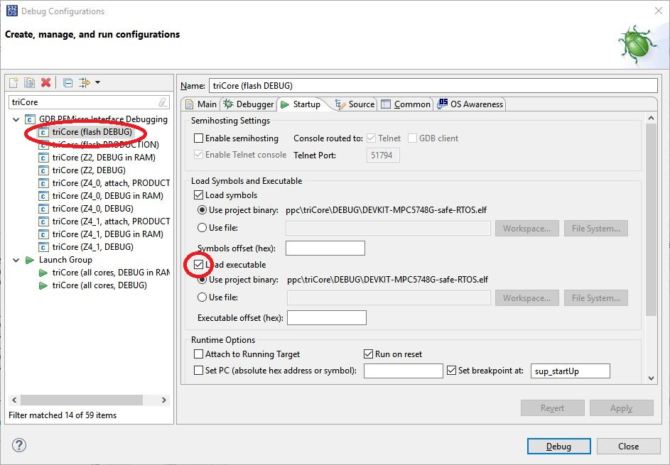

= CAN communication with DEVKIT-MPC5748G
:Author:            Peter Vranken 
:Email:             mailto:Peter_Vranken@Yahoo.de
:toc:               left
:xrefstyle:         short
:numbered:
:icons:             font
:caution-caption:   :fire:
:important-caption: :exclamation:
:note-caption:      :paperclip:
:tip-caption:       :bulb:
:warning-caption:   :warning:

== About this DEVKIT-MPC5748G sample

This DEVKIT-MPC5748G sample implements a reusable CAN communication I/O
driver for MPC5748G and MPC5775B/E and demonstrates its use. Some
features of the driver:

* Compatible with safe-RTOS' driver model
* Support of one to eight available CAN devices (four on the MPC5775B/E)
* Pin configuration only for CAN device 0 and DEVKIT-MPC5748G: On the PCB
  of this evaluation board, this CAN device is equipped with a transceiver
  chip and connected to connector P5. Just connect your Vector, Kvaser or
  PEAK CAN device and run first tests
* The driver supports standard CAN
* Ease of use: One-by-one relation between mailboxes in the hardware and
  CAN ID. We have plenty of mailboxes so that sharing of mailboxes between
  different CAN IDs won't ever be required
* Rx FIFO can be enabled to further increase the number of mailboxes. We
  have a maximum of 96 to 186 mailboxes available per device, depending on
  how many are processed by the FIFO
 ** This number can even be increased to 276 if no extended CAN IDs are in
    use
 ** MPC5775B/E: 64 to 154 mailboxes or up to 244 if no extended CAN IDs
    are in use
* Mailboxes can be operated by polling or by interrupt
 ** Mailboxes are organized in groups of 4, 8, 16 or 32. Each group can
    have its own interrupt - processed by the same or individual handlers,
    having same or different interrupt priority, processed on the same or
    on different cores
* Mailboxes have their individual privileges configuration. A mailbox can
  e.g. be dedicated to the safety process only. If so, a task from the QM
  process would neither be able to see the interrupt notification (if any)
  nor to use the polling or transmission APIs
* Configuration with compile-time expressions. Applying C99's designated
  initializer expressions, the readability and maintainability of the
  configuration file is pretty good

== How to use the driver

Explanation on how to use the driver can be found in it's https://github.com/PeterVranken/DEVKIT-MPC5748G/blob/master/samples/CAN/code/system/drivers/CAN/readMe.adoc[readme^] file and
in
https://github.com/PeterVranken/DEVKIT-MPC5748G/blob/master/samples/CAN/code/system/drivers/CAN/cdr_canDriverAPI.h[cdr_canDriverAPI.h^],
which is the principal header file for client code of the driver.

== Concept

=== Configuration

The CAN driver's source code is compiled together with a configuration
file, which consists of C source code, too. It declares and defines all
the needed static settings as an initialized _const struct_. The use of
designated initializer expressions keeps this piece of source code
comprehensible and well-maintainable.

Part of the driver implementation is a
https://github.com/PeterVranken/DEVKIT-MPC5748G/blob/master/samples/CAN/code/system/drivers/CAN/cdr_canDriver.config.inc.template[template
configuration file^]. Any client application of the driver will copy this
file to a local folder, where it is renamed to _cdr_canDriver.config.inc_
and then modified to match the needs of the particular application.

Rational of holding the driver configuration in a separate, dedicated
file, which can be kept apart from the driver implementation is the
possible re-use of the same source code in different scenarios. Mainly,
this addresses having several test applications, which can all be build in
the same environment and which may all use different driver
configurations.

The configuration starts with a set of principal macros, which enable or
disable each of the physical available CAN devices. These macros control
the compilation of code and data elements of the driver. Code elements
like interrupt service routines (ISR), configuration and data objects will
only be compiled (and consume resources) if the related CAN device is
enabled.

The configuration is a compile-time constant. There are several constraints
and crosswise dependencies between different configuration items. Some of
these can be checked already at compile-time by means of preprocessor
conditions and static assertions. However, many other checks can be done
only at run-time. A check function is offered, which will normally execute
only in DEBUG compilation. Due to its static, constant character, a
configuration which has been proven once (in DEBUG compilation) can never
fail - and PRODUCTION compilation doesn't need to waste time with a
repeated check. (Of course, it can if someone wants it to do.)

=== User model

The driver does by far not offer all options of the underlying hardware to
the client code. It has a simple model of CAN transmission and this is
offered to the client code in form of the driver API. This is how the
perception model of the CAN driver looks like:

The CAN communication is done through mailboxes. The number of mailboxes
is fixed by hardware limits and by configuration decisions. This limits
the number of different CAN IDs, which can be received and sent.

Each mailbox is either for reception (Rx) or transmission (Tx) but not
both at a time. Only normal CAN frames are supported, there's no support
for Remote Frames and nor for CAN FD. Each mailbox can be used with
exactly one CAN ID, there's no sharing of mailboxes between different CAN
IDs.

Each mailbox needs to be configured prior to its use. This is a run-time
configuration by API call from the driver's client code. The configuration
associates a mailbox with a CAN ID and it makes it either Rx or Tx. The
configuration can fail for several reasons and the client code needs to
check the reported result.

An Rx mailbox can be used either by polling or by interrupt with
notification. A Tx mailbox can be used without or with interrupt on
transmission-complete and notification.

A number of Rx mailboxes can be realized by a hardware FIFO in the CAN
device. If this mode is chosen then the total number of Rx mailboxes
raises significantly but the additional ones can only be used with
notification; polling is not possible with these.

TODOC: Handles of mailboxes, ranges of handles are known so that the
differing properties of the mailboxes can be addressed even through the
use of handles (dedicated sub-section?)

CAN transmission is supported by two APIs, which take the mailbox handle
and the payload as argument. The simple one will send the message with
initially agreed CAN ID and DLC, the more complex allows to use the
mailbox with varying CAN ID and DLC -- it's possible to do all
transmission with a single Tx mailbox.

=== Safety

The driver is implemented in compliance with the I/O driver model of
safe-RTOS. CAN communication can be integrated into an application without
endangering the safety-concept. 

TODOC:

* Safety concept of notifications into user code out of scope of driver.
  No direct callback into user code. Use of safe-RTOS mechanisms to make
  that happen in client code (which will still belong to OS code)
* Rx mailboxes with individual decision notification vs. polling.
  Polling with privileges, e.g. mailbox accessible only by safety process
* Tx mailbox have individual privileges. Can be access only by configured
  process. E.g. only safety can send a particular CAN ID
* Sending from user process only in the simple form. No arbitrary CAN IDs
  possible for Tx from user process
* Mailbox configuration permitted to user process but OS can make the
  first choice and e.g. make all settings for the safety process, which
  can't be overridden by the user process any more
* API buffer handling to ensure data access without memory protection
  exceptions

== Tools

=== Environment

==== Command line based build

The makefiles and related scripts require a few settings of the
environment in the host machine. In particular, the location of the GNU
compiler installation needs to be known and the PATH variable needs to
contain the paths to the required tools. 

For Windows users there is a shortcut to PowerShell in the root of this
GitHub project, which opens the shell with the prepared environment.
Furthermore, it creates an alias to the appropriate GNU make executable.
You can simply type `make` from any location to run MinGW32 GNU make.

The PowerShell process reads the script `setEnv.ps1`, located in the
project root, too, to configure the environment. This script requires
customization prior to its first use. Windows users open it in a text
editor and follow the given instructions that are marked by TODO tags.
Mainly, it's about specifying the installation directory of GCC.

Non-Windows users will read this script to see, which (few) environmental
settings are needed to successfully run the build and prepare an according
script for their native shell.

[[secOpenEclipse]]
==== Eclipse for building, flashing and debugging

Flashing and debugging is always done using the NXP S32 Design Studio for
Power Architecture, an Eclipse IDE, which is available for free download
and nearly unrestricted use in commercial and non commercial projects.

If you are going to run the application build from the Eclipse IDE then
the same environmental settings as described above for a shell based build
need to be done for Eclipse, too. The easiest way to do so is starting
Eclipse from a shell, that has executed the script `setEnv.ps1` prior to
opening Eclipse.

For Windows users the script `S32DS-IDE.ps1` has been prepared. This script
requires customization prior to its first use. Windows users open it in a
text editor and follow the given instructions that are marked by TODO
tags. Mainly, it's about specifying the installation directory of
the S32 Design Studio.

Non-Windows users will read this script to see, which (few) environmental
and path settings are needed to successfully run the build under control
of Eclipse and prepare an according script for their native shell.

Once everything is prepared, the S32 Design Studio will never be started
other than by clicking the script `S32DS-IDE.ps1` or its equivalent on
non-Windows hosts.

TODOC: Where to get the tools, how to install them
//See https://github.com/PeterVranken/TRK-USB-MPC5643L[project overview^] and
//https://github.com/PeterVranken/TRK-USB-MPC5643L/wiki/Tools-and-Installation[GitHub
//Wiki^] for more details about downloading and installing the required
//tools.

=== Compiler and makefile

Compilation and linkage are makefile controlled. The compiler is GCC
(MinGW-powerpc-eabivle-4.9.4). It is part of the S32 Design Studio
installation and can be used independently from the Studio. The makefile
is made generic and can be reused for production projects that want to
make use of safe-RTOS. It supports a number of options (targets); get an
overview by typing:
 
    cd <projectRoot>/samples/CAN
    mingw32-make help

The main makefile `GNUmakefile` has been configured for the build of
sample "CAN". Type:

    mingw32-make -sO build
    mingw32-make -sO build CONFIG=PRODUCTION

to produce the flashable files
`bin\ppc\default\DEBUG\DEVKIT-MPC5748G-CAN.elf`, and
`bin\ppc\default\PRODUCTION\DEVKIT-MPC5748G-CAN.elf`.

File `GNUmakefile` has a variable `defineList`, which is a list of options
for the build. A major option is `LINK_IN_RAM`. If you place this option
into the list then the same build commands link the software for execution
in RAM. (See next section for details). With option `LINK_IN_RAM`, the same
commands:

    mingw32-make -sO build
    mingw32-make -sO build CONFIG=PRODUCTION

produce the flashable files
`bin\ppc\default\DEBUG-RAM\DEVKIT-MPC5748G-CAN.elf`, and
`bin\ppc\default\PRODUCTION-RAM\DEVKIT-MPC5748G-CAN.elf`.

To get more information, type:

    mingw32-make --help
    mingw32-make help

WARNING: The makefile requires the MinGW port of the make processor. The
Cygwin port will fail with obscure, misleading error messages. For your
convenience, we have uploaded an appropriate recent version of the MinGW
make processor into this GitHub project. The PowerShell startup script
aliases this (Windows) executable to the command `make`. Moreover,
explicitly typing `mingw32-make` will generally avoid any problem.

The makefile is designed to run on different host systems but has been
tested with Windows 7 and Windows 10 only.

[[secRunInRAM]]
=== Running your application in RAM

The makefile and the linker scripts support the location of the code
entirely in RAM. The MPC5748G has plenty of RAM so that even large pieces
of code can be loaded and executed in RAM. This is extremely helpful for
code development. Loading the code into the device's RAM is significantly
faster than into ROM and many flash erase and program cycles can be saved.
Even if your complete project may not fit into RAM then you may still
consider it useful to build some sub-modules together with their testing
code in this way.

Nothing particular has to be done to load a compiled software into RAM.
The GNU debugger in the Design Studio just looks at the addresses of code
and data objects in the binary file (`*.elf`). It'll erase and flash the
ROM if the objects have ROM addresses and it'll load them into RAM if the
objects are located in RAM. So all we have to do is defining the memory
addresses in the linker scripts accordingly in the one or the other way.

Under control of a macro in the main makefile, `GNUmakefile`, the linker
chooses different address ranges. If the macro `LINK_IN_RAM` is element of
the list of macros then the linker will divide the physically available
RAM into 67% for code or text and constant data sections (512k) and 33%
for data sections (256k). If the macro is not defined in the list then all
768k of RAM are available to the data sections.

The macro is seen by the C source code at compile-time, too. However,
there are barely dependencies. The MPU configuration is the principal
exception and some execution timing operations are dependent on the macro,
too.

To switch between linkage in ROM or RAM, open file `GNUmakefile` in a text
editor and look for the definition of variable `defineList`. The left hand
side expression is a blank-separated list of symbols, which are passed to
the compiler and linker as preprocessor #define. Add `LINK_IN_RAM` if
you want to run your code in RAM.

WARNING: Running the software in RAM is useful but, by principle, a
preliminary, temporary way of working only. Running the software can be done
only under control of the debugger, which is needed to load the binary
data into the MCU's RAM. A start of the software out of reset or after a
power-up or without connected Design Studio is impossible.

=== Flashing and debugging

The code of this DEVKIT-MPC5748G sample can be flashed and debugged with
the S32 Design Studio IDE. Effectively, flashing means to start the GNU
debugger (GDB) and to let it "load" the *.elf file. If the code is linked
in flash ROM address space then this loading means writing to the flash.
Consequently, a flash configuration in the Eclipse IDE is nearly identical
to any ordinary debug configuration, just the option "Load executable" to
load a file is checked. Ordinary debug configurations, i.e. for debugging,
don't have this check mark set:

[[figDebugConfigFlash]]
.Eclipse debug configuration, which is used for flashing

Connect your evaluation board DEVKIT-MPC5748G with the USB wire and start
the S32 Design Studio as outlined above (<<secOpenEclipse>>). Now you can
find the debug configuration shown in <<figDebugConfigFlash>> in menu
"Run/Debug Configurations..." A dialog listing all available debug
configurations opens. Type "flash" in the text box, which initially has
the focus, to filter all of them, which are intended for flashing and
select the one you need. Press the Enter key or click on button "Debug"
and the flash process begins. Progress and status messages are printed in
one of the console windows in the lower right corner.

It's a bit counter-intuitive that flashing with GDB is just a kind of side
effect of starting the debugger. Rather than with a "Congratulations,
flashing successfully completed"-message, flashing ends with a ready to
use interactive debug session: The source code window shows the startup
code for the boot core Z4A and you could go ahead and step through the
just flashed code. However, you won't typically do so and rather stop this
debug session again. This is why:

In the S32 Design Studio, a debug session for projects running _n_ cores
requires opening a combination of _n_ Eclipse debug configurations, one
for each core. Such a combination is called a "Launch Group". Our flash
configurations generally use only a single debug configuration, because
our project links all the code in one *.elf file, regardless of the number
of cores, which are in use. Therefore, if you'd really go ahead with the
flash debug session then you could only control and observe boot core Z4A.
Better to close it again and start a more appropriate Launch Group.

[[figLaunchGroup]]
.Debug configuration to chose when debugging a multi-core software
image::readMe_resources/debugLaunchGroup.jpg[Debug configuration to chose when debugging a multi-core software, width="70%", pdfwidth="70%", align="center"]

If you built your software for execution in RAM (see <<secRunInRAM>>) then
you don't need to flash. No matter what is currently flashed, just start
the according debug configuration. The RAM is loaded with your software
and you can start it with the usual debugger commands to step and run,
etc. If you end the debug session while the cores are all running (i.e.
none of the cores is halted in a breakpoint) then the software in RAM even
stays alive and can be observed without debugger connection. Only after
next reset the ROM software will take effect again.

By the way, the debug sessions can be found also by a click on the black
triangle next to the blue icon "bug". The last recently used
configurations are listed in the menu. To see all of them or to
double-check their properties you'd click "Debug Configurations...",
somewhere down below the list. In the new dialog, select the wanted one
and start the debugger with a last click on button "Debug".

== Code architecture

=== Book E versus VLE

Only VLE code is supported.

== Known issues

. Debugger: If the view shows the INTC0 register set then the debugger
harmfully affects program execution and the RTOS fails: The write to
INTC_EOIR_PRC0, which normally restores the current priority level
INTC_CPR_PRC0, now fails to do so. The complete interrupt handling fails
from now on. Mostly the effect is that the OS tick interrupt, which has a
high priority, leaves this high priority level set in the INTC_CPR_PRC0,
so that effectively no interrupts (including itself) are handled any more.
Only the code of the idle task is executed any longer.
+
Workaround: Don't open the view of the INTC0 in the debugger when
debugging a safe-RTOS application. Then the INTC and the code work fine.

. Debugger: A similar effect has been observed with the instructions to
alter the External Interrupt enable bit, MSR[EE]. Do not single-step in
the debugger over wrtee(i) instructions. The instruction may fail to
change the bit. If the code approaches such an instruction you should use
the right-click operation "Run to line", targeting the instruction behind
the wrtee(i). This works fine.

. Debugger: A similar effect has been observed when putting a breakpoint
on the first instruction of an exception handler. (Which is indeed a
natural desire to be informed about exceptions.) The correct exception
handling is confused. The CPU state is not correctly stored in the xSRRi
registers and the MSR bits are not properly updated, at least not the
External Interrupt enable bit, MSR[EE]. Further software execution has
barely a chance. Workaround is to set the breakpoint a few instructions
further on in the exception handler.

. Debugger: It is not possible to hinder the P&E debugger from halting at
an se_illegal instruction. (See https://community.nxp.com/thread/497533)
This makes it impossible to debug the fault catching capabilities of the
RTOS. All severe code errors, which lead to the execution of an arbitrary
address, will sooner or later encounter a zero word in the instruction
stream and the debugger will break -- before the RTOS can catch the error.
It is possible to continue the code execution from the debugger and to
see, what the RTOS will do but this is an interactive process and
systematic testing of error catching code is not possible this way. We can
only do it without connected debugger.