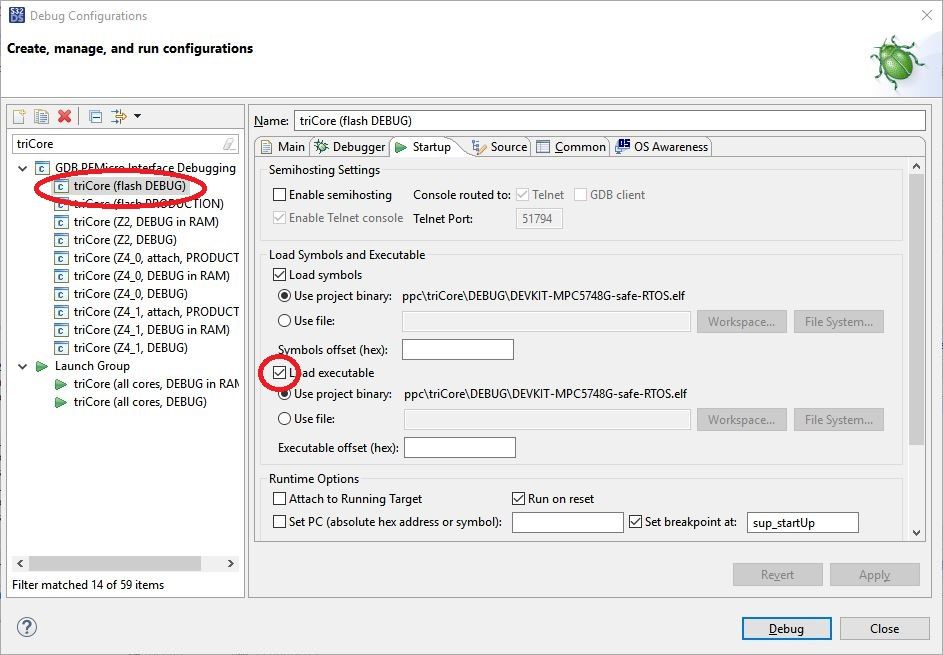
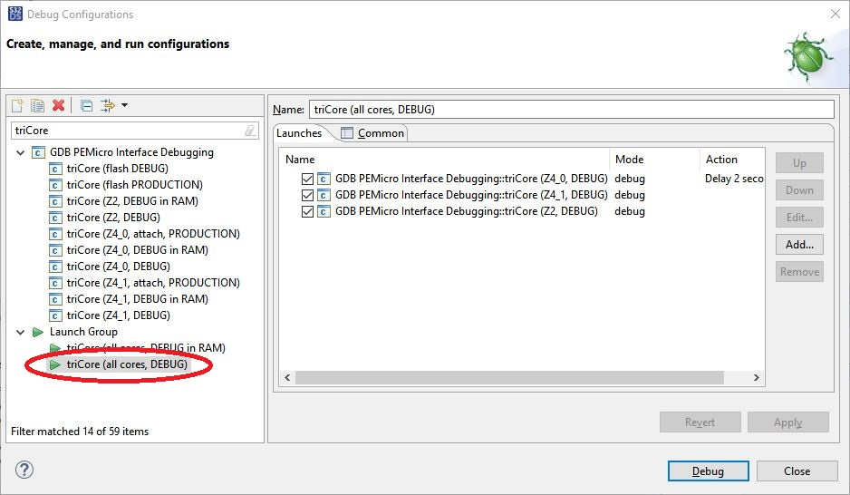

= TCP/IP and UDP/IP communication with DEVKIT-MPC5748G
:Author:            Peter Vranken 
:Email:             mailto:Peter_Vranken@Yahoo.de
:toc:               left
:xrefstyle:         short
:numbered:
:icons:             font
:caution-caption:   :fire:
:important-caption: :exclamation:
:note-caption:      :paperclip:
:tip-caption:       :bulb:
:warning-caption:   :warning:

== About this DEVKIT-MPC5748G sample

This DEVKIT-MPC5748G sample integrates the most popular Open Source
Internet Protocol stack, which is
https://savannah.nongnu.org/news/?group=lwip[lwIP^]. lwIP offers TCP and
UDP and some sub-ordinated protocols, e.g., for name resolution. lwIP
itself doesn't contain the Ethernet device driver layer. This sample
integrates an Ethernet driver from the
https://www.nxp.com/design/design-center/software/development-software/s32-sdk/s32-software-development-kit-for-power-architecture:S32SDK-POWER-ARCHITECTURE[NXP Software Development Kit for Power Architecture^].
Here are some features of the sample:

* Integration of lwIP release 2.2 (Sep 25, 2023).
* Integration of Ethernet driver from NXP SDK 3.0.1.
* The lwIP standard IP applications ping is enabled
* IP protocol MDNS is enabled and allows addressing to the board by name
  rather than be IP address only.
* TFTP is enabled and allow data upload from the board. Only a minimal
  code extension would be required to demonstrate data download, too.
* HTTP protocol is enabled. The board provides a minimalistic "Web-page".
* An own, project specific IP application demonstrates how to use TCP for
  the proprietary communication needed by your own application.
* The pin configuration has been made for board DEVKIT-MPC5748G; just
  connect your PC and the board by LAN wire and try the software.

lwIP is distributed as source code and it was possible to use the original
source code without any modification. This will make a later upgrade to a
new release of lwIP most easy. Just replace folder
`lwip-STABLE-2_2_0_RELEASE` with a more recent download and re-build the
sample.

The NXP Ethernet driver underwent some modifications to make it compatible
with the
https://github.com/PeterVranken/DEVKIT-MPC5748G/tree/master/samples/safe-RTOS/doc/manual#io-driver-model[I/O driver model^]
of safe-RTOS. Moreover, a minor extension of its state
model was required for safe buffer management. Please note, NXP software
is freely available and may be used on NXP MCUs without restriction but
it's not Open Source. The license terms are found as
`code/system/drivers/ETH/RTM/license.txt`.

== Behavior of the sample application

Sample TCP builds on the elder sample CAN. The CAN stack is still
integrated and working the same way as it does in sample CAN. To
demonstrate the capabilities of TCP based communication the behavior of
the elder SW has been adopted by the new one. The elder sample offered to
add selected CAN signals to its listener and the values of these signals
become reported when the containing message is received. Reporting had
been done in the console window. Now, the same information is distributed
by TCP. A Telnet client running on the PC can make a connection to the
evaluation board and will receive all the information about received CAN
signals. Several Telnet clients can try to connect simultaneously. (The
maximum number allowed is a compile time constant.)

Besides this application specific demonstration of TCP/IP communication,
there are some lwIP standard applications, which are enabled, too. Out of
the box, the board will respond to ping requests, it can be addressed by
name ("DEVKIT-MPC5748G") as well as by IP address (192.168.1.200) because
of the MDNS service, data can be fetched using the Trivial FTP protocol
and last but not least, the board can be addressed with an HTTP request
from a normal browser window. Unfortunately, HTTPS is not supported.

Control of the sample application and status feedback are both done via
the serial interface, see below.

All IP communication is done via the only Ethernet plug of the evaluation
board. The IP address is 192.168.1.200 and the port number depends on the
IP application, see below.

All CAN communication is done via the only CAN transceiver of the
evaluation board. The CAN bus is configured to run at 500 kBd.

The messages from the
https://github.com/PeterVranken/DEVKIT-MPC5748G/blob/master/samples/TCP/code/application/canStack/dbcFiles/sampleCanBus.dbc[CAN database^]
(a *.dbc file) are registered at the BSW. Periodic Tx messages are
sent with the signal default values and Rx messages are received and
the signal values are internally stored.

Optionally, and by default, a second *.dbc file
https://github.com/PeterVranken/DEVKIT-MPC5748G/blob/master/samples/TCP/code/application/canStack/dbcFiles/PWM.dbc[PWM.dbc^]
is merged into the communication on the same bus. It defines two
messages, one to control some PWM output channels and one to broadcast the
measurement results from two PWM inputs.

The application has a user interface based on serial I/O. You need to open
a terminal application on your development host machine, which the
evaluation board is connected to via USB. The NXP software implements a
virtual COM device on the host machine; open this COM channel with 115200
Bd, 8 Bit, no parity bit, 1 stop bit. Type *help* to begin. A usage
message is printed with the available commands.

The principal commands are:

* *listen:* A signal from one of the Rx messages in the CAN database is
named. On every future reception of the message, which contains this
signal, the newly received signal value will be printed into your console
and potentially to the TCP/IP connections with TCP port 1234, which have
been established from the host machine using an application like Telnet.

* *set:* A signal is named together with a numeric value. The internally
held signal value is changed accordingly. For regular messages it means
that the new value will be considered at the next due time of the message.
For event messages, the command is at the same time the triggering event
and the message is sent immediately with the new value

* *show:* Enable or disable regular reporting of particular events, e.g.
the PWM measurement results

* *PWM:* Set the new frequency and duty cycle of a PWM output -- if it is
not currently under control of the CAN interface.

Some additional commands are available, too.

Controlling the PWM outputs via CAN is explained best by looking into file
https://github.com/PeterVranken/DEVKIT-MPC5748G/blob/master/samples/TCP/code/application/canStack/dbcFiles/PWM.dbc[PWM.dbc^].
The CAN message PWM_out has signals to set frequency and duty cycle of the
connected PWM channels and there is a Boolean to switch between CAN
control and control via command line otherwise.

The effect is strongest if the PWM output PA1, on extension port J3, pin 1 is
connected to both PWM inputs, PA2 on J3, pin 3 and PA6 on J2, pin1. At PA2
the frequency of the PWM is measured and at PA6 its duty, i.e., high time.
If both inputs are fed with the same input then the duty cycle in percent
can be calculated.

== Safety features

The integration of lwIP demonstrates that it is possible to run nearly the
entire IP stack inside the protected user context. Only the (quite lean)
Ethernet driver is running in the kernel context and would need to
undergo all safety validation. All of the lwIP implementation and the TCP
and UDP application on top of lwIP are running in the QM process and can
do no harm to the operating system or the safety process.

== How to run the integrated IP application

TODOC Briefly describe the IP applications and how to use them from the
host PC.
  
== How to use lwIP for your own application

Look at the integrated and operational IP applications and use their
source code as starting point for the implementation of your IP
application:

* `code/application/ipStack/apps/http_demoHttpServer.c`: If your
  application should provide an own Web-page.
* `code/application/ipStack/apps/tftp_example.c`: If your application
  wants to use either the UDP or the TFTP protocol for data exchange in
  either direction.
* `code/application/ipStack/apps/clg_canLoggerOnTCP.c`: If your
  application wants to setup a TCP connection for bi-directional data
  exchange with another node.

== Tools

=== Environment

==== Command line based build

The makefiles and related scripts require a few settings of the
environment in the host machine. In particular, the location of the GNU
compiler installation needs to be known and the PATH variable needs to
contain the paths to the required tools. 

For Windows users there is a shortcut to PowerShell in the root of this
GitHub project, which opens the shell with the prepared environment.
Furthermore, it creates an alias to the appropriate GNU make executable.
You can simply type `make` from any location to run MinGW32 GNU make.

The PowerShell process reads the script `setEnv.ps1`, located in the
project root, too, to configure the environment. This script requires
customization prior to its first use. Windows users open it in a text
editor and follow the given instructions that are marked by TODO tags.
Mainly, it's about specifying the installation directory of GCC.

Non-Windows users will read this script to see, which (few) environmental
settings are needed to successfully run the build and prepare an according
script for their native shell.

[[secOpenEclipse]]
==== Eclipse for building, flashing and debugging

Flashing and debugging is always done using the NXP S32 Design Studio for
Power Architecture, an Eclipse IDE, which is available for free download
and nearly unrestricted use in commercial and non commercial projects.

If you are going to run the application build from the Eclipse IDE then
the same environmental settings as described above for a shell based build
need to be done for Eclipse, too. The easiest way to do so is starting
Eclipse from a shell, that has executed the script `setEnv.ps1` prior to
opening Eclipse.

For Windows users the script `S32DS-IDE.ps1` has been prepared. This script
requires customization prior to its first use. Windows users open it in a
text editor and follow the given instructions that are marked by TODO
tags. Mainly, it's about specifying the installation directory of
the S32 Design Studio.

Non-Windows users will read this script to see, which (few) environmental
and path settings are needed to successfully run the build under control
of Eclipse and prepare an according script for their native shell.

Once everything is prepared, the S32 Design Studio will never be started
other than by clicking the script `S32DS-IDE.ps1` or its equivalent on
non-Windows hosts.

TODOC: Where to get the tools, how to install them
//See https://github.com/PeterVranken/TRK-USB-MPC5643L[project overview^] and
//https://github.com/PeterVranken/TRK-USB-MPC5643L/wiki/Tools-and-Installation[GitHub
//Wiki^] for more details about downloading and installing the required
//tools.

=== Compiler and makefile

Compilation and linkage are makefile controlled. The compiler is GCC
(MinGW-powerpc-eabivle-4.9.4). It is part of the S32 Design Studio
installation and can be used independently from the Studio. The makefile
is made generic and can be reused for production projects that want to
make use of safe-RTOS. It supports a number of options (targets); get an
overview by typing:
 
    cd <projectRoot>/samples/CAN
    mingw32-make help

The main makefile `GNUmakefile` has been configured for the build of
sample "CAN". Type:

    mingw32-make -sO build
    mingw32-make -sO build CONFIG=PRODUCTION

to produce the flashable files
`bin\ppc\default\DEBUG\DEVKIT-MPC5748G-CAN.elf`, and
`bin\ppc\default\PRODUCTION\DEVKIT-MPC5748G-CAN.elf`.

File `GNUmakefile` has a variable `defineList`, which is a list of options
for the build. A major option is `LINK_IN_RAM`. If you place this option
into the list then the same build commands link the software for execution
in RAM. (See next section for details). With option `LINK_IN_RAM`, the same
commands:

    mingw32-make -sO build
    mingw32-make -sO build CONFIG=PRODUCTION

produce the flashable files
`bin\ppc\default\DEBUG-RAM\DEVKIT-MPC5748G-CAN.elf`, and
`bin\ppc\default\PRODUCTION-RAM\DEVKIT-MPC5748G-CAN.elf`.

To get more information, type:

    mingw32-make --help
    mingw32-make help

WARNING: The makefile requires the MinGW port of the make processor. The
Cygwin port will fail with obscure, misleading error messages. For your
convenience, we have uploaded an appropriate recent version of the MinGW
make processor into this GitHub project. The PowerShell startup script
aliases this (Windows) executable to the command `make`. Moreover,
explicitly typing `mingw32-make` will generally avoid any problem.

The makefile is designed to run on different host systems but has been
tested with Windows 7 and Windows 10 only.

[[secRunInRAM]]
=== Running your application in RAM

The makefile and the linker scripts support the location of the code
entirely in RAM. The MPC5748G has plenty of RAM so that even large pieces
of code can be loaded and executed in RAM. This is extremely helpful for
code development. Loading the code into the device's RAM is significantly
faster than into ROM and many flash erase and program cycles can be saved.
Even if your complete project may not fit into RAM then you may still
consider it useful to build some sub-modules together with their testing
code in this way.

Nothing particular has to be done to load a compiled software into RAM.
The GNU debugger in the Design Studio just looks at the addresses of code
and data objects in the binary file (`*.elf`). It'll erase and flash the
ROM if the objects have ROM addresses and it'll load them into RAM if the
objects are located in RAM. So all we have to do is defining the memory
addresses in the linker scripts accordingly in the one or the other way.

Under control of a macro in the main makefile, `GNUmakefile`, the linker
chooses different address ranges. If the macro `LINK_IN_RAM` is element of
the list of macros then the linker will divide the physically available
RAM into 67% for code or text and constant data sections (512k) and 33%
for data sections (256k). If the macro is not defined in the list then all
768k of RAM are available to the data sections.

The macro is seen by the C source code at compile-time, too. However,
there are barely dependencies. The MPU configuration is the principal
exception and some execution timing operations are dependent on the macro,
too.

To switch between linkage in ROM or RAM, open file `GNUmakefile` in a text
editor and look for the definition of variable `defineList`. The left hand
side expression is a blank-separated list of symbols, which are passed to
the compiler and linker as preprocessor #define. Add `LINK_IN_RAM` if
you want to run your code in RAM.

WARNING: Running the software in RAM is useful but, by principle, a
preliminary, temporary way of working only. Running the software can be done
only under control of the debugger, which is needed to load the binary
data into the MCU's RAM. A start of the software out of reset or after a
power-up or without connected Design Studio is impossible.

=== Flashing and debugging

The code of this DEVKIT-MPC5748G sample can be flashed and debugged with
the S32 Design Studio IDE. Effectively, flashing means to start the GNU
debugger (GDB) and to let it "load" the *.elf file. If the code is linked
in flash ROM address space then this loading means writing to the flash.
Consequently, a flash configuration in the Eclipse IDE is nearly identical
to any ordinary debug configuration, just the option "Load executable" to
load a file is checked. Ordinary debug configurations, i.e. for debugging,
don't have this check mark set:

[[figDebugConfigFlash]]
.Eclipse debug configuration, which is used for flashing

Connect your evaluation board DEVKIT-MPC5748G with the USB wire and start
the S32 Design Studio as outlined above (<<secOpenEclipse>>). Now you can
find the debug configuration shown in <<figDebugConfigFlash>> in menu
"Run/Debug Configurations..." A dialog listing all available debug
configurations opens. Type "flash" in the text box, which initially has
the focus, to filter all of them, which are intended for flashing and
select the one you need. Press the Enter key or click on button "Debug"
and the flash process begins. Progress and status messages are printed in
one of the console windows in the lower right corner.

It's a bit counter-intuitive that flashing with GDB is just a kind of side
effect of starting the debugger. Rather than with a "Congratulations,
flashing successfully completed"-message, flashing ends with a ready to
use interactive debug session: The source code window shows the startup
code for the boot core Z4A and you could go ahead and step through the
just flashed code. However, you won't typically do so and rather stop this
debug session again. This is why:

In the S32 Design Studio, a debug session for projects running _n_ cores
requires opening a combination of _n_ Eclipse debug configurations, one
for each core. Such a combination is called a "Launch Group". Our flash
configurations generally use only a single debug configuration, because
our project links all the code in one *.elf file, regardless of the number
of cores, which are in use. Therefore, if you'd really go ahead with the
flash debug session then you could only control and observe boot core Z4A.
Better to close it again and start a more appropriate Launch Group.

[[figLaunchGroup]]
.Debug configuration to chose when debugging a multi-core software

If you built your software for execution in RAM (see <<secRunInRAM>>) then
you don't need to flash. No matter what is currently flashed, just start
the according debug configuration. The RAM is loaded with your software
and you can start it with the usual debugger commands to step and run,
etc. If you end the debug session while the cores are all running (i.e.
none of the cores is halted in a breakpoint) then the software in RAM even
stays alive and can be observed without debugger connection. Only after
next reset the ROM software will take effect again.

By the way, the debug sessions can be found also by a click on the black
triangle next to the blue icon "bug". The last recently used
configurations are listed in the menu. To see all of them or to
double-check their properties you'd click "Debug Configurations...",
somewhere down below the list. In the new dialog, select the wanted one
and start the debugger with a last click on button "Debug".

== Code architecture

=== Book E versus VLE

Only VLE code is supported.

== Known issues

. Debugger: If the view shows the INTC0 register set then the debugger
harmfully affects program execution and the RTOS fails: The write to
INTC_EOIR_PRC0, which normally restores the current priority level
INTC_CPR_PRC0, now fails to do so. The complete interrupt handling fails
from now on. Mostly the effect is that the OS tick interrupt, which has a
high priority, leaves this high priority level set in the INTC_CPR_PRC0,
so that effectively no interrupts (including itself) are handled any more.
Only the code of the idle task is executed any longer.
+
Workaround: Don't open the view of the INTC0 in the debugger when
debugging a safe-RTOS application. Then the INTC and the code work fine.

. Debugger: A similar effect has been observed with the instructions to
alter the External Interrupt enable bit, MSR[EE]. Do not single-step in
the debugger over wrtee(i) instructions. The instruction may fail to
change the bit. If the code approaches such an instruction you should use
the right-click operation "Run to line", targeting the instruction behind
the wrtee(i). This works fine.

. Debugger: A similar effect has been observed when putting a breakpoint
on the first instruction of an exception handler. (Which is indeed a
natural desire to be informed about exceptions.) The correct exception
handling is confused. The CPU state is not correctly stored in the xSRRi
registers and the MSR bits are not properly updated, at least not the
External Interrupt enable bit, MSR[EE]. Further software execution has
barely a chance. Workaround is to set the breakpoint a few instructions
further on in the exception handler.

. Debugger: It is not possible to hinder the P&E debugger from halting at
an se_illegal instruction. (See https://community.nxp.com/thread/497533)
This makes it impossible to debug the fault catching capabilities of the
RTOS. All severe code errors, which lead to the execution of an arbitrary
address, will sooner or later encounter a zero word in the instruction
stream and the debugger will break -- before the RTOS can catch the error.
It is possible to continue the code execution from the debugger and to
see, what the RTOS will do but this is an interactive process and
systematic testing of error catching code is not possible this way. We can
only do it without connected debugger.