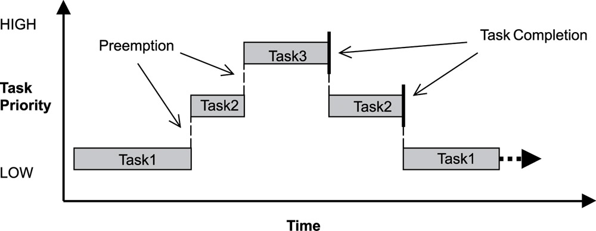

= safe-RTOS - Manual
:Author:              Peter Vranken
:Email:               mailto:Peter_Vranken@Yahoo.de[P. Vranken]
:Revision:            2
:title-page:
//:toc:                 left
:toc:
:toclevels:           4
:numbered:
:xrefstyle:           short
ifndef::env-github[:icons: font]
ifdef::env-github[]
:caution-caption:     :fire:
:important-caption:   :exclamation:
:note-caption:        :paperclip:
:tip-caption:         :bulb:
:warning-caption:     :warning:
endif::[]
// https://asciidoctor.org/docs/user-manual/

// @todo Maybe we need a section explaining the multi-core concept and why the promised core-to-core communication mechanisms bared show up in the manual
// @todo: Halting a process relates to the calling core only. Not a bug but maybe counter-intuitive
// @todo Configuration with rtos.config.h and its template
// @todo Configuration of processes and their stack size in the linker file
// @todo align use of `xxx`, _xxx_ and <<secXxx,xxx>> and of _xxx_() vs. _xxx()_. First decision: <<secApiRunTask,rtos_runTask()>> is best

== Scope

safe-RTOS is a successor of the simple RTOS
(https://github.com/PeterVranken/TRK-USB-MPC5643L/tree/master/LSM/RTOS[Ref.
 1^]) previously published in GitHub. The successor RTOS implements the
mechanisms, which are the prerequisite for an operating system kernel that
is intended for use in the software for a safe system, according to the
relevant safety standards, like ISO 26262.

== Abbreviations

[frame="none",width="80%",options="header",cols="^20%,80%"]
|=======
|Abbreviation|Meaning

|ADC| Analog-digital converter
|BCC| Basic conformance class
|CPU| Central processing unit
|GUI| Graphical user interface
|LCD| Liquid crystal display
|LED| Light-emitting diode
|I/O| Input/output
|ISO| International Organization for Standardization
|ISR| Interrupt service routine
|MCU| Microcontroller unit
|MMU| Memory management unit
|MPU| Memory protection unit
|OS| Operating system (kernel plus I/O drivers)
|OSEK| Offene Systeme und deren Schnittstellen für die Elektronik im Kraftfahrzeug
|PCP| Priority ceiling protocol
|RAM| Random access memory
|ROM| Read only memory
|RTOS| Real time operating system
|SD| Secure Digital
|SDA| Small data area
|SPR| Special purpose register
|VDX| Vehicle Distributed Executive
|WET| Worst (case) execution time
|=======

== References

[frame="none",width="90%",options="header",cols="10%,30%,60%"]
|=======
|| Document | Description
| Ref. 1
  | https://github.com/PeterVranken/TRK-USB-MPC5643L/tree/master/LSM/RTOS
  | Simple RTOS
|=======

== Introduction

safe-RTOS is a successor of the simple RTOS previously published in
GitHub. The scheduler implements rate monotonic scheduling, i.e. it
implements a strictly hierarchical preemption pattern, which is for
example called tasks of "Basic Conformance Class" in the OSEK/VDX-OS
standard and which -- as a matter of experience and despite of its
simplicity -- suffices to drive the majority of industrial applications.

By means of compile-time configuration, the kernel can be instantiated on
any set of cores. Nonetheless, safe-RTOS is still not a multi-core RTOS.
The different kernel instantiations don't have any awareness of one
another and there are no core-spawning scheduling strategies. However, a
number of core-to-core comunication basics is offered; we have a shared
memory concept, which considers the complexity introduced by the cache,
mutex objects, spin locks and an interrupt based core-to-core notification
mechanism.

To meet the demands of safety-critical software, the concept of processes
has been added to the kernel. Software partitions or applications of
different criticality levels can be implemented and run in different
processes without fearing harmful interferences between them. A process is
a set of tasks, which have their own resources and cannot touch the
resources of the tasks from another process. These "resources" are
basically memory (data objects) and CPU (computation time; here the
resource protection has its limits, see deadline monitoring for details).
The kernel offers the mechanisms to design I/O drivers in a way that I/O
channels or I/O data become protected resources, too.

Memory protection is implemented with the memory protection unit (MPU) of
the microcontroller. The MPU contains a number of memory area descriptors,
which associate a range of memory addresses (defined by start and end
address) with access rights. Mre precise, it are addresses, regardless
whether memory, I/O registers or nothing is found at these addresses. Any
load and store of the CPU is either permitted by at least one of the
descriptors and then executed or it is suppressed and leads to an
exception. The access rights can be granted for read and/or write, they
depend on the CPU's current execution mode ("problem state", see below)
and they can be granted to either all or only a particular process.

The configuration of the memory area descriptors in the MPU, i.e. the
assignment of memory areas and/or I/O address space to the processes, is
done statically, it is done once at system startup. This has several
implications:

* Simple and lean code architecture with zero overhead for memory
  protection (no swapping of memory area descriptors)
* No indeterministic timing due to hit-miss-interrupts and according
  corrective actions
* Limitation of number of processes due to the given, fixed number of
  memory area descriptors in the MPU (four application processes plus one
  kernel process in the default configuration)
* Simple, barely changeable memory layout for kernel and processes (see
  below for details)
* Implementation of C code is tightly coupled with linker script. This is
  a strong disadvantage if the kernel should be integrated into an
  existing software development project, which will already have its own
  linker script. The essential requirements and implementation elements
  from both linker scripts need to be identified, coordinated and merged

//Note, the MMU is not really used in this RTOS, although it can do
//basically the same as the MPU. The integration with the CPU is even
//tighter and the exception behavior smoother and better. The reason for
//still not using it is the bad granularity of the managed memory areas.
//Using the MPU, we can make the areas match the actual, linker-computed
//memory consumption of the processes but with the MMU we would end up with
//fixed size, pre-defined chunks of memory for the processes, e.g. 4k, 8k,
//16k of RAM.
//
//The MMU remains active, it's a kind of primary access filter for CPU loads
//and stores, not process specific but catching all accesses, which are
//generally out of bounds, e.g. address space, where no physical memory or
//I/O sits at all.

The protection of the other resource, CPU ownership, is mainly done by time
monitoring of the tasks. If a task doesn't terminate timely then it causes
an exception. The kernel supports deadline monitoring; a task (may) have a
termination date and if it hasn't terminated at that time then it is
aborted by exception. This concept ensures that a task either meets its
deadline (i.e. has produced its results timely) or the timing problem has
been recorded and is reported, typically to some supervisory task.

Note, deadline monitoring always punishes the failing task, although it
is not necessarily the causing task. A task may fail to meet its deadline
because it has been overly blocked by other tasks of higher priority - if
these do not exceed their deadline then only the poor task of lower
priority is punished. This may be not fair but it is to the point as the
system design fails to meet the timing requirements for the punished task.

A second, simpler yet often advantageous mechanism is offered for time
protection. The situation is recorded and reported as an "activation loss"
error when an event is triggered but not all tasks associated with the
event have terminated yet after the preceding trigger of the event. For
the most typical use case of timer events and regular tasks this would
have the meaning of a task overrun.

The kernel offers the priority ceiling protocol (PCP) to the tasks for
implementing mutual exclusion. A minor modification of this common
technique is a measure to protect the scheduling of the CPU against abuse
or software faults. The PCP is limited to tasks of a certain, configurable
maximum priority. PCP cannot hinder application tasks to execute, which
have a higher priority and it is therefore possible to implement a trusted
supervisory task, which can detect forbidden and potentially unsafe
blocking states caused by failing or malicious functional tasks.

The outlined protection mechanisms were useless if application code could
circumvent them - be it by intention or because of uncontrolled execution
of arbitrary code fragments after a failure in the task. A task could for
example try changing a memory area descriptor in the MPU prior to
accessing otherwise forbidden memory or it could try suspending all
interrupt processing to get exclusive ownership of the CPU.

All of this is hindered by the two "problem states" of the CPU. It knows
the user and the supervisor mode. The CPU starts up in supervisor mode. In
this mode all instructions are enabled. The startup code configures the
MPU and ensures that the register set of the MPU belongs to a memory area,
which is accessible only for supervisor mode. The kernel switches to user
mode when an application task is started. Instructions, which would change
back to supervisor mode are not available in user mode. The application
task code cannot change the MPU configuration in its problem state (MPU
hinders access in user mode) and it cannot enter the supervisor mode to do
it then.

More general, what has been outlined specifically for the MPU holds for
all the I/O registers and many of the special purpose registers (SPR) of
the CPU. All of these can be accessed in supervisor mode only.
Consequently, a user task cannot access or re-configure any I/O device or
protected SPR.

All of the described mechanisms together allow the design of a "safe
software" on top of this RTOS. (You can find a definition of a safe
software in our context in <<secSafetyConcept>>.)

== The RTOS

=== Overview Functionality

The features of safe-RTOS:

* Configurable to run on any core
* Preemptive, priority controlled scheduling
* Five pre-configured processes (including kernel) with disjunct memory
  address spaces and hierarchic privileges
* Tasks belong to processes and share the process owned memories
* Globally shared memory for communication purpose may be used
* Hardware memory protection to ensure integrity of process owned memories
* Secured priority ceiling protocol for communication purpose
* Inter-process function calls for communication purpose
* Deadline monitoring and activation loss counters for avoidance of
  blocking tasks
* Exception handling to catch failures like use of privileged, illegal or
  misaligned instructions or forbidden access to memory or I/O
* Diagnostic API to gather information about failing processes and the
  possibility to halt critical processes
* I/O driver model for safe implementation of a complete operating system

The proposed RTOS is little exciting with respect to its functionality.
The scheduler implements the functionality of what is called the "Basic
Conformance Class 1" (BCC1) of the OSEK/VDX-OS standard and of its BCC2 with
the exception of activation queuing.

The scheduler offers an API to create events that can activate tasks. An
event is either a regular timer event, triggered by the RTOS system clock,
or a software triggered event. The latter can be triggered either from
user code (if it has sufficient privileges) or from ISRs belonging to the
operating system.

The RTOS offers a pre-configured set of four user processes. The
limitation to four is a hardware constraint and for sake of simplicity no
virtualizing by software has been shaped. The operating system forms a
fifth process. The operating system startup code will register the needed
tasks. The registration assigns them to one of the processes and
associates them with one of the created events.

All scheduling is strictly priority controlled. The triggering of an event
makes all associated tasks ready to run. This is called task activation.
At any time, the scheduler decides by priority, which of the _ready_ tasks
becomes the one and only _running_ task. This may involve preemption of
tasks.

The operating system startup code can install needed interrupt service
routines (ISR). This will mostly appear in the initialization of the added
I/O drivers.

For mutual exclusion of tasks, if shared data is involved, a lock API is
offered that implements the priority ceiling protocol (PCP). It is secured
so that supervisory tasks cannot be accidentally or purposely blocked.

There are two slightly differing mechanisms to suspend and resume
interrupts but they are not available to application code, only the
operating system may use them (mainly for I/O driver implementation).

The use of the RTOS is further supported by some diagnostic functions.
They offer stack usage information, information about caught exceptions
and averaged CPU load information. The diagnostics come along with an API
to halt the execution of a (failing) process. Permission to use this API
is granted only to what is considered the safety process or task.

=== Scheduler and preemption

The RTOS implements only tasks of basic conformance class (BCC). A task is
a finite code sequence, which is entirely executed, when it comes to a
task activation. BCC means that a task will have to complete before any
other task of same or lower priority can execute. Preemption occurs only
when a task is activated, which has a priority higher than the currently
running task. The preempting task is started and needs to complete before
the preempted task can continue execution. The preemption pattern of tasks
is strictly hierarchical, similar to the execution of nested functions in
a C program, see figure <<figSchemeOfPreemptions>>.footnote:[The picture
has been downloaded at
http://www.embeddedlinux.org.cn/rtconforembsys/5107final/images/other-0405_0.jpg
on Nov 19, 2017.]

[[figSchemeOfPreemptions]]
.Hierarchical task scheduling

The hierarchical preemption pattern of tasks enables stack re-usage.
Basically, all tasks could share a single stack. However, the process
concept requires a separate stack per process, be it kernel or
user process. Moreover, all cores have an independent instance of the
kernel. Hence, given the number of user processes on the three cores be
n1, n2 and n3 then we would have a total of 3+n1+n2+n3 stacks.

Although BCC means a significant reduction of complexity and functionality
in comparison to a full featured real time kernel, the embedded practice
mostly doesn't require more than this. The typical data flow paradigm of
an industrial embbeded application is to have event triggered tasks, which
serve the asynchronous I/O channels and strictly cyclic application tasks,
which process the data and implement the control strategies. The
communication between ISRs and tasks is done either by queues or by
overwriting (last recent value supersedes earlier ones), that depents.
It's a simple model, which has the advantage of being well understood,
transparent and by nature free of dead locks. The latency times are higher
than for consequently designed event controlled systems but they are
predictable and have easy to determine upper bounds. Last but not least,
software design can determine the upper bounds by choosing appropriate
cycle times. 

=== Events

A task activation always happens by means of an event. The event is an
RTOS object, which is created in the initialization code sequence. A set
of tasks can be associated with an event. We have the relation 1:n for
events to tasks. Any task is associated with exactly one event. An event
has a method to trigger it. When the event is triggered then all
associated tasks are triggered (and the scheduler will execute them in the
order of priority).

An event can be configured such that it is implicitly triggered by the
RTOS clock. This functionality is limited to an arbitrary time for the
first trigger and an infinite, regular sequence of further triggers.
Evidently, this aims at "normal", regular tasks. However, even these
events still have the method for explicit trigger by software so that more
complex activation patterns could be implemented.

Triggering an event is a privileged operation. By configuration it is
decided, which process may use the method for which event. For the
majority of events, this will only be the kernel process but there are
reasonable use cases for user tasks triggering specific events, too, and
-- as long as privileges are granted with care -- without breaking the
safety concept.

The method to trigger an event can be used from ISRs and from tasks. The
former can be used to implement deferred interrupt handling.

=== The operating system clock

The RTOS is clocked by a timer interrupt. The clock rate is a compile time
configuration item and can be adjusted in units of a Millisecond. Most
sample applications of safe-RTOS use a 1 ms or a 10 ms clock tick. This
configured clock tick is the resolution of controlling the period of
cyclic tasks.

The clock is generated by one of the MCU's PID devices. If safe-RTOS is
configured to run on different cores then each core uses its dedicated PID
timer. The configured timers are not available to the application. If the
application requires to use the other PID timers then the initialization
needs to be done with care: For the PIT devices, there are common
settings, which affect all PID timers. You need to align your
initialization code with the RTOS kernel initialization, see
_rtos_osInitKernel_().

[[secPrioTaskAndISR]]
=== Priority of tasks and interrupts

The priority scheme of tasks is disjunct with that of interrupts. The
priority range of interrupts is 1..15. The priority range of tasks is
1..UINT_MAX. Regardless of the chosen numbers, any interrupt has a
priority higher than any task. An application task cannot shape a critical
section with interrupts but an OS task can do. (Which is one of the many
reasons, why an OS, which is built on this RTOS, must not make OS tasks
available to untrusted application code.)

Preemption takes place only by higher priority; once a task is running
it'll not be preempted by any other of same or lower priority. If two or
more tasks of same priority become ready at the same time then they are
executed sequentially, i.e. one after another. This introduces a kind of
sub-ordinated priority, which determines the order of execution in this
situation. This sub-ordinated priority is defined at RTOS configuration
time; in the given situation, the tasks would be executed primarily in
order of creation of the events, they are associated with, and secondarily
in order of registration, if they are associated with one and the same
event; see _rtos_osCreateEvent_(), _rtos_osRegisterOSTask_() and
_rtos_osRegisterUserTask_() for details.

What does "become ready at the same time" mean? This can be as easy as two
cyclic tasks that become due at the same nominal operating system clock
tick. For event tasks, which are triggered from one or more ISRs it's less
evident. One ISR can trigger several events or several nesting, preempting
ISRs can each trigger one or more events. Due to the generally higher
priority of interrupts in comparison to tasks, all of the tasks, which are
associated with any of the triggered events, become effectively due at the
(logically) same time and compete for the CPU immediately after return
from the last of the nested interrupts. In this situation, the
sub-ordinated priority counts for those of same priority.

TIP: A most important aspect of tasks of same priority -- it doesn't
matter whether they are associated with the same event or with different
events of same priority -- is that there are by principle no race
condition between them. They can easily share data objects without any
concern about using keyword _volatile_ or the need to implement critical
section code.

=== Exception handling

The RTOS catches all possible MCU exceptions. Normal, failure free
operation of OS and application tasks will not cause exceptions; the
RTOS makes barely use of exceptions as principle of operation - like it
would for example when using the MPU exception for reloading some memory
descriptors. Therefore, an exception always means reporting an error.

Any exception handler will first check, which process the exception
causing task belongs to. The RTOS maintains process related error counters
and the according counter is incremented. The exception handler will then
abort the failing task, i.e. it does do basically the same as the RTOS API
_rtos_terminateTask_() does, which voluntarily ends a task. Code execution
does not return to the failing code location. If a regular, time triggered
task fails, then it'll be triggered again at next due time, regardless of
the number of counted failures.

This is virtually all, the RTOS does. In particular, there's no error
callback or code to investigate the cause of the problem and to maybe
repair it. Similarly, there's no decision logic which would limit the
number of failures and to stop a process in case.

Instead, our concept is to have a supervisory task -- either as an element
of the implemented operating system or in the application code -- , which
uses the RTOS' APIs to observe the number of reported failures and to take
the decisions for halting bad processes, switching off, shutting down or
what else seems appropriate.

Our working assumption is that the OS code is proven to have no faults, so
there's no need to handle an exception in this code. (The assumption of
fault free code is often referred to as "trusted code".) However, nobody
is perfect and even kernel or an I/O driver may contain undiscovered
errors. There's no way to handle an exception caused by the OS code. In
this case, the exception handler enters an infinite loop to effectively
halt the software execution. It's considered a matter of appropriate
configuration of watchdogs and of appropriate hardware design to ensure
that this will keep the system, which the software is made for, in a safe
state.

=== Deadline monitoring

User tasks, regardless if triggered by events or run by services
_rtos_osRunTask_() or _rtos_runTask_(), can have a bounded timespan for
completion. The ultimate end time is called the deadline of the task and
the supervision is called deadline monitoring.

The timespan is the world time, not an execution time budget. At the
instance of starting the task its end time is defined. To the supervision,
it doesn't matter whether the task really executes or if other tasks of
higher priority get the CPU most of the time. It is considered a failure
of the task if it doesn't terminate prior to its deadline. This causes an
exception, which is counted in the process. The deadline exception has an
own counter and so it can be distinguished from all other exceptions; this
is essential because it'll mostly be necessary to judge differently on
this exception in comparison to others (see below).

The way it works is simple and efficient. The RTOS has a simple BCC
kernel, that doesn't allow a task to suspend voluntarily. It is ready from
triggering till termination. This leads to a strictly hierarchical
preemption scheme (see <<figSchemeOfPreemptions>>) and, as a consequence,
to a single, ordinary stack for the kernel process. Each started task is
represented by a stack frame on this stack. When starting the task, the
kernel creates the stack frame and stores the deadline as an element. If
the task is preempted then a new stack frame is put on the stack (for an
ISR or a task of higher priority). During the execution of the preempting
context the kernel doesn't care, whether the deadline of the preempted
task is exceeded or not -- the task can't do any harm, it's not executing
and the kernel could anyway not remove it from somewhere in the middle of
the stack. Only on return from the preempting context, when normally all
registers of the preempted context would be restored from the stack, the
deadline condition is checked. This requires only a few instructions; it's
an arithmetic comparison of the stored end time with the CPU's time base
register. The decision is clear - either we complete the return to the
preempted context or we raise an exception, which kills it. The
implementation can be that easy because the check is done when and only
when we return to the stack frame of the preempted, deadline-monitored
task: Now the end time is easily accessible and killing the task in case
is simply doable, because it's on top of the stack.

The deadline monitoring aims only at protecting a supervisor user task of
high priority against starvation. Without it, a notification callback from
an ISR could spin in an infinite (or very long lasting) loop and the
supervisory task would not be scheduled until it returns.

Deadline monitoring is not meant a mechanism to control some task timing
in a functional sense. Any application design, which considers regular or
even occasional intervention of the mechanism as normal, will be bad
design! Therefore, a supervisory task should not generally tolerate
deadline exceedance exceptions in the supervised processes. It may need to
tolerate very rare occurrences due to exceptional high system load
and an accordingly high jitter in the task timing.

Understanding these aims of the mechanism it becomes clear, why its
weaknesses are not painful. The check is only done on return from a
preempting context to the monitored task. This limits the time resolution.
The RTOS itself has a 1 ms interrupt, so the only general guarantee is an
according time resolution. The idea to limit e.g. a notification callback
to 50 µs will not work. If you think 50 µs should be enough under all
circumstances then you should indeed specify this time span. But
regardless, the callback may run up to 1 ms before it is surely killed.

You can of course count on a better time resolution if you have an
interrupt of higher frequency but if it pays off to install such an
interrupt only for the particular purpose of increasing the time
resolution will depend.

Despite of the enormous possible relative timing error we see in our
example it doesn't matter much with respect to the safety supervisory
task. When it becomes due the next time this will surely be connected to
an RTOS timer tick and this tick would mean the killing event for the bad
callback. No blocking for the safety task.

The worst thing, which can happen to the safety supervisory task: Its n-th
activation may be preempted by an ISR which invokes a bad, non returning
callback. The callback is killed at latest at the next RTOS timer tick. If
this tick is the same one at which the safety task becomes due the (n+1)st
time then the task would suffer from an activation loss; its n-th
activation would be resumed rather than starting the (n+1)st. If this
endangers the safety concept then the effect can be avoided by configuring
the RTOS timer tick frequency higher than the activation frequency needed
for the safety supervisory task.

Less obvious is a priority issue. An ISR, which runs a potentially failing
callback, can have an interrupt priority higher than the RTOS timer and
any other regular interrupt. So that there's no upper boundary for the
maximum execution time of the callback. This consideration leads to the
safety requirement for the aimed operating system that any ISRs, which
run at a priority higher than the RTOS timer interrupt must not make use
of the service _rtos_osRunTask_(). The requirement is easy to fulfill as
all affected code is in the trusted sphere and most of it are static
configuration decisions.

By principle, a deadline exception (as any other, too) can leave the
system in an inconsistent (yet not instable) state. The task may have been
killed in the middle of a critical section, in the middle of whatever
transaction. This may make other tasks fail, too, and lead to more
exceptions in the worst case. An important requirement for the safety
process is (and actually not only because of this effect) that it must be
functional regardless of the consistency of the data owned by the
supervised processes.

==== Deadline monitoring: To be used or better not?

The design of an operating system building on safe-RTOS can make the
consideration, whether or not deadline monitoring needs to be applied at
all. If some design rules are obyed then the observation of the event
activation loss counters from the safety supervisory task will be
sufficient in most cases (see service _rtos_getNoActivationLoss_()).

Using deadline monitoring is absolutely unavoidable if ISRs make use of
callbacks into user processes (using service _rtos_osRunTask_()). However,
in many situations this construct can be replaced by deferred interrupt
handling, i.e. by triggering an OS task that takes over the work from the
ISR. The triggered task would have a priority below the safety task and if
it is blocked by a non-returning, bad callback into the user process then
the safety task would immediately see the activation losses for the event
triggered by the ISR and likely some other (timer) events.

Typically, the latency times resulting from observation of activation
losses will be a bit higher than when applying deadline monitoring. This
may have an impact on the design decisions.

=== Distribution and integration

The RTOS itself is not a runnable piece of software. It requires some
application code. The RTOS is distributed as a set of source files with
makefile and linker scripts and a few sample applications. The makefile
can take the name of an arbitrary file folder as root folder of an
application. This is the way a particular sample application is chosen.
The specified folder is recursively scanned for C/C++ and assembler source
files, which are compiled together with the RTOS source files and the
compilation ends up with a flashable binary file, which contains the
entire runnable software.

If you consider using safe-RTOS for your purposes, then it's likely that
you already have your own development environment in place. If you want to
integrate the RTOS into this environment then it's unfortunately more
complicated then just copying our RTOS sources into your project and
compiling them there -- the RTOS implementation depends on several
definitions made and decisions taken in the linker scripts and these
needed to be adopted by your compilation process. Please, refer to
<<secMemoryLayout>> for details about the linker script.

==== Single image versus three images

The NXP code samples for the DEVKIT-MPC5748G produce three separate memory
images, one per core. Our makefile produces just one for all cores. There are
several implications:

* Debugger configuration: Three instances are launched. In our project
  configuration, only the first one will load the image. The other two will
  just load the symbols
* In our project we have a single run of the linker; the NXP concept
  requires the run of the linker for each core. Therefore, we don't need
  preallocation of memory space to cores as done in the NXP samples.
  Linkage will fail only if the overall consumption of memory exceeds
  the physical limits
* Code is generally shared between the cores. No need to link identical
  function code repeatedly into the distinct images of the cores. The C
  library code and our RTOS are found once in ROM and executed by all
  cores
* We have only one symbol and address space for code and data on all cores.
  On source code level, core-to-core communication barely makes a
  difference to task-to-task communication on one core: The code running
  on different cores can simply use the same variable names to access
  shared recourses and they will really address to the same object at the
  same address
* The NXP approach requires a kind of manual linkage for core-to-core
  communication. Shared definitions in the three linker scripts and/or
  related #_define_'s in the source code are needed to ensure that the
  basically independent compile-and-link runs all allocate shared data at
  the same absolute address. This reduces the flexibility of interface
  design and implementation and it is error prone
* Our approach has a single, big disadvantage: By principle, the three
  cores share the SDA and SDA2 address areas. This limits the amount of
  small data address space to a total of 64 kByte each, i.e. the small
  data of all three cores together need to fit into the 64 kByte. The NXP
  approach with independent runs of the linker provides the 64 kByte
  separately to each of the cores.
  
[[secSafetyConcept]]
== The safety concept

This sections aims at giving an overview on the safety concept.

A typical nowadays embedded project consists of a lot of code coming from
various sources. There may be an Open Source Ethernet stack, an Open
Source Web server plus self-made Web services, there may be an Open Source
driver software for a high resolution LCD, a framework for GUIs plus a
self-designed GUI, there will be the self-made system control software,
possibly a file system for data logging on an SD storage, the C
libraries are used, and so on. All in all many hundred thousand lines of
code.

If the system can reach a state, which is potentially harmful to people or
hardware, then it'll typically need some supervisory software, too, which
has the only aim of avoiding such a state. Most typical, the supervisory
software can be kept very lean. Depending on what kind of system we talk,
it may e.g. be sufficient to read a temperature sensor, check the
temperature against a boundary and to control the coil of the main relay,
which powers the system. If the temperature exceeds a limit or if the
temperature reading is somehow implausible then the relay is switched off
and the entire system unpowered. That's all. A few hundred lines of code
can already suffice for such a task.

All the rest of the software is not safety relevant. A fault in this
majority of code may lead to wrong system behavior, customer
dissatisfaction, loss of money, frustration, etc. but will not endanger
the safety of the system or the people using it.

If we rate the safety goal higher than the rest then we have a significant
gain in terms of development effort if we can ensure that the few hundred
lines of supervisory code will surely work always well and even despite of
potential failures of the rest of the code.

Using a safety-aware RTOS can be one means to ensure the "working always
well" of the supervisory code. The supervisory code is put into a process
of higher privileges and the hundred thousands of lines of other code are
placed into a separate process with lower privileges. By principle, the
code in one process can not harm or damage the resources of the other
process (data and access to CPU or computation time). Nor can a process of
low privileges get access to I/O deemed safety-critical. (Only) RTOS and
supervisory code need to be carefully reviewed, tested, validated to
guarantee the "working always well". Using a "normal" RTOS, where a fault
in any part of the code can easily crash the entire software runtime
system, the effort for reviews, tests and validation needed to be extended
to all of the many hundred thousand lines of code. The economic difference
and the much higher risk of not discovering a fault are evident.

These basic considerations result in a single top-level safety requirement
for our safe-RTOS:

* If the implementation of a task, which is meant the supervisory or
  safety task, is itself free of faults then the RTOS shall guarantee that
  this task is correctly and timely executed regardless of whatever
  imaginable failures are made by any other processes, be it on the same
  or another core.

This requirement serves at the same time as the definition of the term
"safe", when used in the context of this RTOS. safe-RTOS promises no more
than this requirement says. As a consequence, a software made with this
RTOS is not necessarily safe and even if it is then the system using that
software is still not necessarily safe. Here, we just deal with the tiny
contribution an operating system kernel can make to a safe system.

All other technical safety requirements are derived from this one.

//=== How to design a safe application using this RTOS?
//
//TODOC (partly done in other, existing sections like system calls and I/O
//driver model):
//
//** All user code in user mode, i.e. permanent switching
//** All I/O access is done in driver code, either explicit on demand by
//   system call or implicitly as implementation of the interrupts (which
//   belong to the driver)
//** The driver can notify user tasks in user mode by invocation of
//   application defined (and potentially unsafe) code. It may have any number
//   of followers. A reasonable concept would mean to notify a level 1
//   application task and a safety task. The safety task could check and/or
//   modify and/or invalidate the I/O data before the level 1 task is
//   informed (inputs) or before the data is processed by the OS (outputs)
//** I/O drivers can have local buffers, which can be read by user tasks
//   (e.g. after notification). Polling paradigm (if no
//   notification is needed) with best performance. Reading becomes direct
//   data access.
//** Same for output but now the buffer needs to be write-accessible for
//   processes, i.e. either local to a single process or in process-shared
//   memory, which makes the data vulnerable
//** I/O drivers may safely advance data to user code; shade a light on
//   handling of pointers.
//*** Driver initialization is OS code. This code can specify a memory area
//   in some user process owned memory to the driver for later placement of
//   result data. Safe as long as no user code can specify the memory
//   addresses
//*** Drivers can on-the-fly test user code specified memory areas, this
//   make it possible to have system calls, which take the address of a data
//   object as argument and place their result at that address
//** Discussion of mutual exclusion with I/O driver interrupts: Possible
//   only with deferred interrupt handling and mutual exclusion with
//   triggered task. Such a task needs to have a priority below the safety
//   task, which may limit the technique to low throughput drivers. Or
//   get/set methods need to become system calls, which degrades
//   performance. Therefore, we define the different conformance classes;
//   a simple get/set can be implemented relatively fast by a "Basic
//   handler"

== I/O driver model

The RTOS implements only the kernel of an operating system. It doesn't do
I/O configuration and processing beyond what's needed for the kernel
operation. The user of the RTOS will most likely develop a software layer
around the kernel, which configures and operates the MCU's I/O devices.

The implementation of servicing a particular I/O channel is usually
called an I/O driver and the union of kernel and all required or supported
I/O drivers can be considered the operating system.

An I/O driver can't simply be programmed just like that. It has to
interact with the kernel - a safety concept for the entire software would
otherwise be impossible. Usually, the I/O driver interfaces between
hardware and application task. Therefore it becomes a bridge between
supervisor and user mode. The programming of the MCU's I/O registers and
servicing the I/O devices' interrupts requires supervisor mode but the
API for the application tasks to fetch or set the conveyed I/O data needs
to be executable in user mode.

=== Memory mapped I/O driver

The simplest way to implement an I/O driver is the memory mapped driver.
All conveyed information is placed in memory, which can be accessed from
the application tasks and from the OS. 

The API is a set of getters and/or setters, which simply read from or
write to this memory. The I/O driver registers a function at the OS to
process the data. This function can either be a regular timer based OS
task or an interrupt service routine (ISR). This function is executed in
supervisor mode and can do both, access the API memory and the I/O
registers.

Such a driver has one major drawback. There's no immediate data flow
between data source and application task. A typical example would be an
analog input driver, which regularly samples the voltage at the input pins,
e.g. once a Millisecond. The conversion-complete interrupt would read the
ADC result registers and place the samples into the API memory. The
application tasks can read that memory at any time. They surely get the
last recently acquired samples but don't really know the age of the
samples - which can be anything between zero and one Millisecond in our
example. This behavior has a significant impact on worst execution time
(WET) considerations.

A related issue can be the consistency of the data set. The ADC may
provide several input channels, which are sampled coincidentally. The
result-fetching ISR has a priority above those from the application tasks.
Therefore, the ISR can preempt the application task while it is busy with
reading all the channel results. As an effect, the application task will
see some samples from before and some from after the preemption. The set
of samples is inconsistent; the age of the samples differs by one cycle.

If consistency of a data set matters for an interrupt driven I/O driver
then it can either apply a double-buffering strategy or it delegate the
API update to an OS task of sufficiently high priority. Delegation means
the ISR just triggers the event the task is associated with. The task
reads the I/O registers and writes the results into the API buffers. This
design is often referred to as "deferred interrupt handling". The
difference is that the API now can implement critical section code -- this
is possible between different tasks, between OS tasks and ISRs but not
between application tasks and ISRs.

Memory mapped I/O drivers are the best choice whenever the sketched
drawbacks don't matter -- and in particular for input channels: The
application task only reads the API memory and reading memory is not
restricted for any of the processes. The memory can be owned by the driver
implementation and the getters read the results without fearing an MPU
exception.

Additional considerations are required for output channels. It's still
quite easy if only one process is granted access to the API. Now, the API
memory is owned by this process. It can write to this memory through the
setters and the driver code can read and modify it (race conditions
disregarded here).

If however two or more processes want to use the I/O channel then a
remaining simple way of doing is putting the API memory into the shared
memory, which can be written by all the processes. Such an architecture
needs attention as this opens the door for race conditions between
processes and manipulation or violation of data that has been written by
one process by another process. Which can mean a violation of the safety
concept of the aimed software.

An alternative can be a driver architecture with two or more API memory
buffers, one for each process and owned by that process. Note, this
concept requires some arbitration if more than one process wants to
control an output channel in this way.

Memory mapped drivers allow the implementation of privileged output
channels in the most simple way. For example, a safety critical actuator
must be available exclusively to the safety process. Just let the API
memory be owned by that process and any other process trying to access the
output will be punished by an MPU exception but not be able to operate the
actuator.

=== Callbacks

Particularly for input channels, the main disadvantage of memory mapped
drivers, the disrupted data flow, can be eliminated with an I/O driver
using callbacks.

Two possibilities exist. Firstly, the driver may offer to serve a user
defined callback. The application task would specify a function to be
called from the I/O driver if some data becomes available. The I/O driver
will likely be implemented as an ISR, which is invoked by hardware, when
the I/O device acquired the data. Inside the ISR, the implementation will
make use of the RTOS API to run a user task, namely _rtos_osRunTask_(). The
task function is of course the agreed callback.

The callback is executed in the context of the aimed application process.
If it would fail (e.g. forbidden memory access causes an MPU exception)
then it would be aborted and control went immediately back to the the task
starting ISR.

A typical element of this architecture would be the use of deadline
monitoring. The callback is a sub-routine of the ISR and its execution
time would prolongate the execution time of the ISR - which is constrained
in typical scenarios. A deadline for the (unknown, untrusted) user
callback code will limit the possible damage by bad callback behavior.

The callback is executed at same priority as the ISR, i.e. a priority
above all normal tasks and particularly above the safety task. This
involves a safety risk: Deadline monitoring is not generally available to
tasks with an interrupt priority greater or equal to the kernel priority
(a configurable compile-time constant) and running untrusted callback code
without an execution time constraint would break the safety concept of the
aimed software; an infinite loop would already suffice to hinder the
supervisory task from executing.
  footnote:[It would be a considerable design decision to implement the
safety task in turn as a callback from a (regular timer) ISR of even
higher priority to overcome this problem.]

The second way to implement a callback is using a dedicated event. The
callback is implemented as a task, which is associated with the event. By
triggering the event, the ISR activates the task. Independently, the
scheduler of the RTOS decides when to make the task running. The task is
user code owned, belongs to the same, supervised process and can implement
the notification as suitable in this context.

There are significant differences between both solutions:

* Using an event means less time uncertainty for the ISR implementation.
  The event has a lower priority than the ISR, so the ISR is surely not
  preempted and triggering the event will be done in no time. The ISR can
  return soon
* Using the event means to have better control on priorities. The callback
  has a priority, which can be balanced with the other tasks. The other
  side of the coin: This can break the intended tight coupling in time,
  which is normally expected from interruppt based I/O drivers

Please refer to the sample I/O driver
https://github.com/PeterVranken/DEVKIT-MPC5748G/tree/master/samples/safe-RTOS/code/system/drivers/ledAndButton[ledAndButton^]
for additional details. This driver uses the first method to implement an
immediate notification of a user process when a button on the evaluation
board is pressed or released.

=== The system call

The next way to design an I/O driver is the system call. The system call
is a function, which is executed in supervisor mode. In our RTOS, the
supervisor mode is not constrained in accessing I/O registers and memory
locations. Therefore, a system call can be applied to do any kind of I/O.

CAUTION: The system call function is executed in supervisor mode and
doesn't have exception handling or failure reporting and handling. By
principle, the implementation belongs into the sphere of proven, trusted
code. A user or application supplied function must never be accepted or
installed as a system call or be called as a sub-routine of a system call,
only proven driver code can serve as system call. Any exception from this
rule will potentially break the safety concept.

From the perspective of the calling application code, a system call
behaves like an ordinary function call. It has a number of arguments and
it returns a result. Many operating system services can be modelled in
this way.

The kernel offers three kinds of system call functions. They are called
conformance classes and the choice of the right class is a trade-off
between functionality and ease of implementation on the one hand and
overhead or execution time on the other hand.

==== Conformance classes

===== Basic handler

The leanest and fastest system call is the basic handler:

* The basic system call function must be implemented in assembler. The
  RTOS doesn't prepare the CPU context as required for a C compiler made
  function
* The handler is invoked with interrupt handling being suspended. It
  is non-preemptable and must not resume interrupt processing
* The handler must neither use the stack and nor the SDA pointers r2 and
  r13
* The handler must comply with the usual EABI requirements for
  volatile and non-volatile registers
* The basic system call offers a maximum of flexibility and control; the
  handler is not restricted to be just an ordinary synchronous function
  call with return. For example, the "throw exception" system call, i.e.
  _rtos_terminateTask_(), is implemented this way, it returns to the
  operating system but not from the system call
  
The programmer of a basic system call has the full responsibility for
every detail. The only things the RTOS code does are the switch to
supervisor mode and the table lookup operation to find the entry into the
handler. The implementation of the handler takes care for everything else.
For example, if it needs a stack then it is responsible for getting one --
which may be the kernel stack or any memory else, which is known to be
safe. If it wants to make use of the short addressing modes then it would
have to validate or repair the SDA pointers first.

However, as a rule of thumb: If your handler really intends to do these
kind of things then you are likely using the wrong handler conformance
class. Have a look at the others, which provide such kind of services to
you.

The true intention of the basic handler is writing system calls, which
consist of a few machine instructions only, which are then executed
without the significant overhead of the other conformance classes.

Examples are simple I/O drivers: Getting or setting a digital port is a
matter of loading an address plus a load or store - all in all two or
three instructions. Here, the basic handler perfectly suits.
  
===== Simple handler

The "simple handler" will mostly suit for low-computational operations. It
executes slower than a basic handler but can be implemented as a C
function:

* Stack is available
* The handler is a synchronous function call, i.e. it will return a result
  to the calling code
* The handler receives a variable number of function arguments. Note, only
  register based function arguments are supported, which limits the
  function argument data to seven 32 Bit values or accordingly less 64 Bit
  values. No error is reported if a system call implementation would have
  more arguments; undefined, bad system call behavior would result
* The handler receives the ID of the calling process. The implementation
  of a process based concept of privileges is easy and straightforward
* The handler may throw an exception, typically in case of bad function
  arguments. An error would be reported for the process and the calling
  task would be aborted
* SDA pointers are validated, short addressing modes can be used
* C code can implement the handler and using C is recommended
* The handler is invoked with interrupt handling being suspended. It is
  non-preemptable and must not resume interrupt processing. No functions
  must be called, neither in the handler function itself and nor in any of
  its sub-functions, which can potentially enable the External Interrupt
  processing. This includes but is not restricted to:
** _rtos_osResumeAllInterrupts_()
** _rtos_osLeaveCriticalSection_()
** _rtos_osResumeAllTasksByPriority_()
** _rtos_osRunTask_()
** _rtos_osTriggerEvent_()

The simple handler should be chosen for quickly executing services,
because it implicitly forms a critical section. Note, this is not a
technical must; the execution time has a behavioral impact but doesn't
harm the system stability and not even the safety concept if there's at
least an acceptable upper bounds.

The handler uses the kernel stack, which cannot be protected by the MPU
like the user process stacks. For a safe software design, it's unavoidable
that the static stack calculation for the handler implementation is
considered for the kernel stack usage estimation.

===== Full handler

Operations, which take a significant amount of computation time (in
relation to the intended interrupt and task timing of the system), should
be implemented as a "full handler". It executes slower than a simple
handler. It has all the advantages of the simple handler plus some
additional:

* The full handler is preemptable. It is entered with External Interrupt
  processing enabled and race conditions appear with other contexts
* All OS services may be used in the implementation, including critical
  section operations and running a user task or triggering an event to
  activate the associated tasks
  
The handler uses the kernel stack, which cannot be protected by the MPU
like the user process stacks. For a safe software design, it's unavoidable
that the static stack calculation for the handler implementation is
considered for the worst case kernel stack usage estimation.

TODO: The user requires a proven and complete table of all services,
telling in which mode/handler class/ISR/OS/application task it can be
used.

==== Safety concept

The implementation of a system call handler -- regardless which
conformance class -- can easily break the safety concept of the software
built on top of this RTOS. It is executed in supervisor mode and the error
catching and reporting mechanisms for user processes and tasks are not
available. This has several implications:

* The implementation of a system call generally belongs into the sphere of
  trusted code
* If the implementation of the system call causes an exception then the
  software execution will be halted on the core. It depends on the chosen
  watchdog concept what this means to the safety concept
* The implementation must not trust any piece of information got from the
  calling user code, which could cause an error or exception:
 ** It's common practice in C to pass a pointer to a function in order to
    pass input data by reference. This will potentially cause an MMU or
    MPU exception if the address is outside the used portions of RAM or
    ROM. Moreover, reading I/O registers can have unwanted side effects,
    which harmfully impact an I/O driver
 ** It's common practice in C to pass a pointer to a function in order to
    let it place the function result at the addressed memory location.
    This will potentially harm the memories of another process or even the
    kernel
 ** Array indexes can be out of bounds and can then lead to the same
    problems as discussed for pointers
* Referenced I/O devices or channels could be connected to safety critical
  actuators, which must not be controllable by the calling user process
* The stack consumption of the implementation needs to be considered for
  the safe definition of the kernel stack
 ** For full handlers, preemption of user tasks has to be taken into
    account: It's theoretically possible that all preemption levels make
    use of the same system call, each burdening the stack with the static
    consumption computed for the system call

The RTOS offers convenience functions to validate user provided pointers.
Although using pointers as arguments of system calls is not recommended at
all, it can be safely done. Please, see _rtos_checkUserCodeReadPtr_() and
_rtos_checkUserCodeWritePtr_().

[CAUTION]
=========
A single system call that blindly trusts a user provided pointer or array
index for either reading or writing breaks the safety concept. It can
crash the entire software system.

Note: For such a crash, we don't even need to assume malicious software,
which purposely abuses the system call; a simple failure in a user process
-- totally unrelated to our system call -- can lead to a straying task,
which hits a system call instruction and enters the system call with
arbitrary register contents (i.e. function arguments) and it would
crash the system.
=========

Note, we didn't mention ordinary programming errors here. It's a general
working assumption that all operating system code is quality proven.

==== Maintaining the system call table

System call functions are statically defined. They are registered at
compilation time. They are all held in an RTOS owned table of such and
the calling code refers to a particular function by index. All the RTOS
has to do to avoid running untrusted code as a system call in supervisor
mode is to do a bounds check of the demanded index.

Organizing all system calls in one global, RTOS owned table requires some
attention drawn to the source code structure. System calls can be offered
by different independent I/O drivers and we want the implementation of
such a driver be self-contained. Instead of making all drivers dependent
on a shared file (which defines the table of system calls) we propose a
code and header file structure, which avoids unwanted code dependencies. A
driver implementation, which offers system calls, will expose them in an
additional, dedicated header file, from which the RTOS source code then
can compile the table. The file is named _mnm_driverName_defSysCalls.h_.
This involves mechanisms to safely avoid both, conflicting, doubly defined
table entries and undefined, empty table entries.

Each core has its own system call table. This has been decided to allow
having different implementations of one and the same service on different
cores. An I/O driver could e.g. be implemented to mainly run on the first
core. Here, the system call implementation will really service the I/O
device. On the other cores, the same system call would rather implement
some core-to-core communication to just get the data, which had already
been acquired on the first core.

TIP: After successful compilation of module _rtos_systemCall.c_ and if you
specify `SAVE_TMP=1` on the command line of _make_ then you can find the
actual, complete system call table in file
_bin/(..)/obj/rtos_systemCall.i_. Open the file in a text editor and
search for `const rtos_systemCallDesc_t rtos_systemCallDescAry`. You will
have a match per core.

The table of system calls has a fixed, maximum number of entries. The
table size is a compile time constant, see macro _RTOS_NO_SYSTEM_CALLS_ in
file _rtos_systemCall.h_. Note, more than one code location needs
maintenance if the constant is changed. Follow the hints given in the
source code comments.

If you design your own I/O drivers it's good practice to reserve index
ranges for each driver, e.g. start the indexes of a driver at multiples of
five or ten. Extensions of the drivers become possible without index
clashes (which are properly reported during the build) and without the
need for reworking other drivers to sort them out.

The system call indexes don't need to form a consecutive sequence of
numbers. Not using certain indexes does no more harm than wasting 8 Byte
of ROM for each unused entry. There's no runtime penalty and,
particularly, no danger of breaking the safety concept due to undefined
entries.

===== System calls of safe-RTOS

The RTOS implementation itself makes use of a few system calls. The index
range 0 .. 19 is reserved for extensions of the kernel and must therefore
not be used by user added code.

.System call indexes in use by safe-RTOS
[options="header",cols="^5,22,^5,24"]
|=======
|Index |Function |Class |Description
|0  |rtos_scBscHdlr_terminateUserTask |Basic | (Premature) task abortion
by user code
|1  |rtos_scBscHdlr_{zwsp}suspendAllTasksByPriority |Basic | PCP: Get
resource or enter critical section
|2  |rtos_scBscHdlr_{zwsp}resumeAllTasksByPriority |Basic | PCP: Release
resource or leave critical section
|3  |rtos_scFlHdlr_triggerEvent |Full | Event trigger by software
|4  |rtos_scFlHdlr_runTask |Full | Run a user task or inter-process
function call 
|5  |rtos_scSmplHdlr_suspendProcess |Simple | Suspend a process forever
|6  |assert_scBscHdlr_assert_func |Basic | Implementation of C assert macro
|7-19 |rtos_scBscHdlr_sysCallUndefined |Basic | Index space reserved for
RTOS extensions 
|=======

===== System calls of sample I/O drivers

A few more system call indexes are used by the sample I/O drivers, LED and
button driver, serial interface driver and system time service. If the
drivers are not used by the client code then these indexes can be reused.
Moreover, it is straightforward to put the drivers onto another index of
your choice. Just have a look at the header files of the drivers.

.System call indexes in use by sample I/O drivers
[options="header",cols="^5,22,^5,24"]
|=======
|Index |Function |Class |Description
|20 |sio_scFlHdlr_writeSerial |Full | Serial I/O driver: Write text string
into serial port
|25 |lbd_scSmplHdlr_setLED |Simple | LED driver: Control an LED
|26 |lbd_scSmplHdlr_getButton |Simple | LED driver: Get button state
|30 |stm_scBscHdlr_getSystemTime |Basic | System timers: Get current time
|=======

==== Sample code

Please refer to the
https://github.com/PeterVranken/DEVKIT-MPC5748G/tree/master/samples/safe-RTOS/code/system/drivers/[sample I/O drivers^]
for additional details and consider using these files as
starting point for your own system call based I/O driver. The samples
cover all conformances classes from the I/O driver model.

== The API of safe-RTOS

The RTOS offers an API for using it. The available functions are outlined
here; more detailed information is found as source code comments in the
files in folder
https://github.com/PeterVranken/DEVKIT-MPC5748G/blob/master/samples/safe-RTOS/code/system/RTOS[code/system/RTOS^]
and particularly in the main header file,
https://github.com/PeterVranken/DEVKIT-MPC5748G/blob/master/samples/safe-RTOS/code/system/RTOS/rtos.h[code/system/RTOS/rtos.h^].

Furthermore, there is the Doxygen API reference at
https://htmlpreview.github.io/?https://raw.githubusercontent.com/PeterVranken/DEVKIT-MPC5748G/master/samples/safe-RTOS-VLE/doc/doxygen/html/globals_func.html[doc/doxygen/html^].
Unfortunately, it is of limited value; Doxygen doesn't scan the assembly
files and a good portion of the required information is missing.

=== Naming conventions

The RTOS API distinguishes functions available to application tasks from
those, which are intended for the operating system only, which is built on
top of the RTOS:

* OS functions are named `rtos_os<FctName>`
* Application functions are named `rtos_<fctName>`
  
OS functions must be used in supervisor mode only, i.e. from ISRs or OS
tasks. Application tasks are executed in user mode. If they try calling an
OS function then they will be punished by an exception.

For application functions it depends. Some may be safely called by both,
application and OS code. (These are mostly very simple memory reading
getter functions.) The documentation of a function `rtos_<fctName>` would
indicate if it were callable also by OS code.

The rest of the application functions is simply not available to OS code
and an attempt to invoke them from an ISR or OS task will halt the
software execution. In case of these functions, there will -- with a few
exceptions -- always be a pair of API functions, one for OS and one for
user code with nearly same functionality. The function documentation will
name the constraints.

TIP: As a matter of experience, during software development time the call
of an application function (mostly it is the system call service
`rtos_systemCall`) from an OS task is the most typical reason for the
software execution being halted in the kernel.

=== Table of available services

// @todo Shall we a have table with all the calls?
// System configuration and initialization:
// 
//   rtos_osCreateEvent                         <<secApiCreateEvent>>
//   rtos_osRegisterInitTask                    <<secApiRegisterTask>>
//   rtos_osRegisterUserTask                    <<secApiRegisterTask>>
//   rtos_osRegisterOSTask                      <<secApiRegisterTask>>
//   rtos_osInitINTCInterruptController         <<secApiInitINTC>>
//   rtos_osRegisterInterruptHandler            <<secApiRegisterIsr>>   bare-metal
//   rtos_osGrantPermissionRunTask              <<secApiConfRunTask>>
//   rtos_osGrantPermissionSuspendProcess       <<secApiConfSuspProc>>
//   rtos_osInitKernel                          <<secApiInitKernel>>
// 
// Control tasks and processes:
// 
//   rtos_osTriggerEvent                        <<secApiTriggerEvent>>
//   rtos_triggerEvent (inline)                 <<secApiTriggerEvent>>
//   rtos_osRunTask (inline)                    <<secApiRunTask>>
//   rtos_runTask (inline)                      <<secApiRunTask>>
//   rtos_terminateTask (inline)                <<secApiTermTask>>
//   rtos_osSuspendProcess                      <<secApiSuspProc>>
//   rtos_suspendProcess (inline)               <<secApiSuspProc>>
// 
// Critical sections:
// 
//   rtos_osSuspendAllInterrupts (inline)       <<secApiSuspIrq>>, bare-metal
//   rtos_osResumeAllInterrupts (inline)        <<secApiSuspIrq>>, bare-metal
//   rtos_osEnterCriticalSection (inline)       <<secApiSuspIrq>>, bare-metal
//   rtos_osLeaveCriticalSection (inline)       <<secApiSuspIrq>>, bare-metal
//   rtos_osSuspendAllTasksByPriority           <<secApiPCP>>
//   rtos_osResumeAllTasksByPriority            <<secApiPCP>>
//   rtos_suspendAllTasksByPriority             <<secApiPCP>>
//   rtos_resumeAllTasksByPriority              <<secApiPCP>>
// 
// System call interface: 
// 
//   rtos_systemCall                            <<secApiSysCall>>
//   rtos_osSystemCallBadArgument               <<secApiTermSysCall>>
//   rtos_checkUserCodeReadPtr (inline)         <<secApiCheckPtr>>
//   rtos_checkUserCodeWritePtr                 <<secApiCheckPtr>>
// 
// Query system state:
// 
//   rtos_osGetIdxCore (inline)                 <<secApiGetIdxCore>>, bare-metal
//   rtos_getIdxCore                            <<secApiGetIdxCore>>, OS contexts
//   rtos_getCoreStatusRegister                 <<secApiGetMSR>>, OS contexts
//   rtos_osGetAllInterruptsSuspended (inline)  <<secApiGetIrqSusp>>, bare-metal
//   rtos_isProcessSuspended                    <<secApiGetProcSusp>>, OS contexts
// 
// Diagnostic interface:
// 
//   rtos_getNoActivationLoss                   <<secApiActivationLoss>>, OS contexts
//   rtos_getNoTotalTaskFailure                 <<secApiTskFailure>>, OS contexts
//   rtos_getNoTaskFailure                      <<secApiTskFailure>>, OS contexts
//   rtos_getStackReserve                       <<secApiStackSpace>>, OS contexts, bare-metal
//   gsl_osGetSystemLoad                        <<secApiCpuLoad>>

Here is a table with an overview on all services, which are available to
user and OS tasks, interrupt service routines and bare-metal applications:

// See http://asciidoc.org/newtables.html or https://leanpub.com/awesomeasciidoctornotebook/read
// frame: top, bottom, topbot, all (default), sides, none
// grid: all (default), none, maybe more
// styles (use <char>| for a single cell, e.g. a|):
//   e: emphasized
//   a: Asciidoc markup
//   m: monospace
//   h: header style, all column values are styled as header
//   s: strong
//   l: literal, text is shown in monospace font and line breaks are kept
//   d: default
//   v: verse, keeps line breaks
// format="csv": Cell comma separated (no leading/trailing comma)
.Overview on kernel services
[options="header",cols="10,6,3"]
|=======
|Service |Callable from|Remarks
// System configuration and initialization:
| <<secApiCreateEvent,rtos_osCreateEvent()>> | OS |
| <<secApiRegisterTask,rtos_osRegisterInitTask()>> | OS |
| <<secApiRegisterTask,rtos_osRegisterUserTask()>> | OS |
| <<secApiRegisterTask,rtos_osRegisterOSTask()>> | OS |
| <<secApiInitINTC,rtos_osInitINTCInterruptController()>> | OS |
| <<secApiRegisterIsr,rtos_osRegisterInterruptHandler()>> | OS, bare-metal |
| <<secApiConfRunTask,rtos_osGrantPermissionRunTask()>> | OS |
| <<secApiConfSuspProc,rtos_osGrantPermissionSuspendProcess()>> | OS |
| <<secApiInitKernel,rtos_osInitKernel()>> | OS |
// Control tasks and processes:
| <<secApiTriggerEvent,rtos_osTriggerEvent()>> | OS, ISR |
| <<secApiTriggerEvent,rtos_triggerEvent()>> | user | inline
| <<secApiRunTask,rtos_osRunTask()>> | OS, ISR | inline
| <<secApiRunTask,rtos_runTask()>> | user | inline
| <<secApiTermTask,rtos_terminateTask()>> | OS | inline
| <<secApiSuspProc,rtos_osSuspendProcess()>> | OS, ISR |
| <<secApiSuspProc,rtos_suspendProcess()>> | user | inline
// Critical sections:
| <<secApiSuspIrq,rtos_osSuspendAllInterrupts()>> | OS, ISR, bare-metal | inline
| <<secApiSuspIrq,rtos_osResumeAllInterrupts()>> | OS, ISR, bare-metal | inline
| <<secApiSuspIrq,rtos_osEnterCriticalSection()>> | OS, ISR, bare-metal | inline
| <<secApiSuspIrq,rtos_osLeaveCriticalSection()>> | OS, ISR, bare-metal | inline
| <<secApiPCP,rtos_osSuspendAllTasksByPriority()>> | OS |
| <<secApiPCP,rtos_osResumeAllTasksByPriority()>> | OS |
| <<secApiPCP,rtos_suspendAllTasksByPriority()>> | user |
| <<secApiPCP,rtos_resumeAllTasksByPriority()>> | user |
// System call interface: 
| <<secApiSysCall,rtos_systemCall()>> | user |
| <<secApiTermSysCall,rtos_osSystemCallBadArgument()>> | OS (system call) |
| <<secApiCheckPtr,rtos_checkUserCodeReadPtr()>> | all | inline
| <<secApiCheckPtr,rtos_checkUserCodeWritePtr()>> | all |
// Query system state:
| <<secApiGetIdxCore,rtos_osGetIdxCore()>> | OS, ISR, bare-metal | inline
| <<secApiGetIdxCore,rtos_getIdxCore()>> | user, OS (deprecated) |
| <<secApiGetMSR,rtos_getCoreStatusRegister()>> | user, OS (deprecated) |
| <<secApiGetIrqSusp,rtos_osGetAllInterruptsSuspended()>> | OS, ISR, bare-metal | inline
| <<secApiGetProcSusp,rtos_isProcessSuspended()>> | user, OS, ISR |
// Diagnostic interface:
| <<secApiActivationLoss,rtos_getNoActivationLoss()>> | user, OS |
| <<secApiTskFailure,rtos_getNoTotalTaskFailure()>> | user, OS |
| <<secApiTskFailure,rtos_getNoTaskFailure()>> | user, OS |
| <<secApiStackSpace,rtos_getStackReserve()>> | user, OS, bare-metal |
| <<secApiCpuLoad,gsl_osGetSystemLoad()>> | OS idle |
|=======

=== System configuration and initialization

==== Allocated MCU resources

The RTOS implementation makes use of a few MCU devices. It takes care of
their initialization and run-time code. Your code must not touch any of
the registers of these devices. Additional to these devices there are
some allocated registers, which you must not touch, neither. The allocated
MCU resources are:

* The IVOR registers
* The software-use SPR
* The process ID register, PID0
* The cache control registers
* The interrupt controller, INTC
* The memory management unit, MMU
* The memory protection unit, MPU
* A periodic interrupt timer per core running safe-RTOS. Which one is
  compile-time configuration
* The system timer, STM

==== Error codes

All of the API functions, which are called at system initialization time
to configure the RTOS appropriately for the implemented operating system,
return an enumeration value, `rtos_errorCode_t`, indicating, whether or
which problem appeared.

The configuration of the RTOS is generally static, i.e. the sets of events
and tasks and the granted privileges will not depend on variable input
data and so the success of the RTOS initialization neither won't.
Consequently, there's no need for a dynamic, intelligent error handling
strategy. The implemented strategy will simply be to start the application
software if and only if all RTOS configuration and initialization calls
return "no error".

The added value of the enumeration only is development support. Having the
error code it's much easier to find or identify the bad configuration
element. Once a configuration is found to be alright all future RTOS
initializations using this configuration won't ever fail again. (Therefore
even a simple assertion would suffice to evaluate the error return codes.)

Please refer to the definition of the enumeration in
https://github.com/PeterVranken/DEVKIT-MPC5748G/blob/master/samples/safe-RTOS/code/system/RTOS/rtos.h[`rtos.h`^]
for the list of recognized configuration errors.

    #include "rtos.h"
    typedef enum rtos_errorCode_t;
    
[[secApiCreateEvent]]
==== Create an event

Tasks are activated by events. At OS initialization time, at first events are
created to specify conditions under which the aimed tasks shall be
activated. These are mostly (regular) time triggers but software trigger
(e.g. from within an ISR) is supported, too.

    #include "rtos.h"
    rtos_errorCode_t rtos_osCreateEvent( unsigned int *pEventId
                                       , unsigned int tiCycleInMs
                                       , unsigned int tiFirstActivationInMs
                                       , unsigned int priority
                                       , unsigned int minPIDToTriggerThisEvent
                                       , uintptr_t taskParam
                                       );

The returned event IDs form a sequence of numbers 0, 1, 2, ... in the
order of creation calls. The ID is required as input to some other API
functions that relate to an event,
<<secApiTriggerEvent,`rtos_triggerEvent`>> in the first place.

The priority is a non zero integer number. Regardless of the number, any
event (and thus all of the associated tasks) will have a priority below any
interrupt. See <<secPrioTaskAndISR>> and <<secApiRegisterIsr>> also.

Parameter `minPIDToTriggerThisEvent` restricts the use of the API
`rtos_triggerEvent` for the given event to processes of sufficient
privileges.

Parameter `taskParam` is provided to the task function as argument. It can
be used as context information, e.g. if the same task function should be
associated with different events. (Which makes them different tasks
entering the same shared code.)

[[secApiRegisterTask]]
==== Registering a task

Tasks are not created dynamically, on demand, but they are registered at
the RTOS before the scheduler is started. The registration of a task
specifies the task function and the event, which will activate the task.
The task function is associated with the event.

Any number of tasks (up to a configurable compile time constant) can be
associated with an event. Later, when the event is triggered, they will
all be executed, in the order of registration, each in its process and
without mutual race conditions.

The RTOS differentiates between three kinds of tasks:

* OS tasks. They belong to the kernel process with PID=0. They are
  executed in supervisor mode and are not protected by the exception
  mechanism. They are intended for use inside the intended operating
  system only. (It'll be very difficult to implement a safe software if
  application code would be run from such a task.) Typical use case are
  regular update functions in I/O drivers
* User tasks. "User" relates to the CPU's problem state; these tasks are
  executed in user mode. Such a task belongs to a user process with
  PID=1..4. User tasks are run under protection and, consequently, you can
  specify a time budget for these tasks
* Initialization tasks. Up to one such task can be specified per process
  (including the kernel process). User process initialization tasks are
  run under protection and, consequently, you can specify a time budget
  for these tasks

The need for the initialization tasks may not be evident. It may look
simpler to let the aimed operating system simply invoke some callback
defined in the application code for initialization. This would however
break the safety concept; application code could fail or take control of
the system. The registered initialization tasks will be executed in user
mode in the according process and can't do any harm to the system
stability.

    #include "rtos.h"
    rtos_errorCode_t rtos_osRegisterOSTask
                            ( unsigned int idEvent
                            , void (*osTaskFct)(uintptr_t taskParam)
                            );
    rtos_errorCode_t rtos_osRegisterUserTask
                            ( unsigned int idEvent
                            , int32_t (*userModeTaskFct)( uint32_t PID
                                                        , uintptr_t taskParam
                                                        )
                            , unsigned int PID
                            , unsigned int tiMaxInUs
                            );
    rtos_errorCode_t rtos_osRegisterInitTask
                            ( int32_t (*initTaskFct)(uint32_t PID)
                            , unsigned int PID
                            , unsigned int tiMaxInUs
                            );

Note the return value of the registered user and initialization task
functions. These tasks are run under protection and an error is reported
in their process if they fail. The return value permits to let the task
voluntarily report a failure in their process the same way a kernel caught
failure would. Use case is hindering the system from startup if something
goes wrong during initialization.

The task functions receive the 32 Bit argument `taskParam`. For regular
timer tasks its widely irrelevant; they receive the constant value, which
is specified at event creation time (see <<secApiCreateEvent>>). Event
triggered tasks receive the value, which is sent with
<<secApiTriggerEvent,_rtos_osTriggerEvent_()>> or
<<secApiTriggerEvent,_rtos_triggerEvent_()>>.

[[secApiInitINTC]]
==== Initialize the interrupt hardware

The RTOS communicates intensively with the interrupt controller of the MCU.
Therefore it has its own initialization routine for this MCU device. You
will need to call this function prior to the first call of
`rtos_osRegisterInterruptHandler` and prior to the kernel startup,
`rtos_osInitKernel`.

Your own MCU initialization code must not contain any further or
alternative code, which accesses the registers of the interrupt
controller.

    #include "rtos.h"
    void rtos_osInitINTCInterruptController(void);

Most of the MCU hardware initialization required by the RTOS is integrated
into the function to start the kernel and doesn't appear in the API. The
added value of making the initialization of the interrupt controller appear
in the API is the option to register your ISRs either before or after the
start of the kernel. Without, it would only be possible after.

Note, on a multi-core MCU, this function is called only once, usually on
the boot core and prior to starting the other cores.

[[secApiRegisterIsr]]
==== Registering an ISR

This function lets your operating system code define a handler (ISR) for
all needed interrupt sources.

    #include "rtos.h"
    void rtos_osRegisterInterruptHandler
                ( rtos_interruptServiceRoutine_t interruptServiceRoutine
                , unsigned int processorID
                , unsigned int vectorNum
                , unsigned int psrPriority
                , bool isPreemptable
                );

_processorID_ selects the core, which runs the ISR if the interrupt
occurs. Usually, this will be the core the function call is used on (see
<<secApiGetIdxCore>> to find out) but it is also possible to centralize
all interrupt configuration at startup-time on the boot core.

_vectorNum_ relates to the hard-wired interrupt sources of the MCU, see
reference manual. Note that the RTOS itself makes use of PID timers as
interrupt source, one on each core running safe-RTOS. The configured PIT
timers must thus never be used anywhere else.

The priority is an integer number in the range 1..15. See
<<secPrioTaskAndISR>> and <<secApiCreateEvent>> also.

The use case for this function is the initialization code of I/O drivers.
Such drivers will frequently make use of interrupts.

Note, this API may be used on a core running a bare-metal application,
i.e. a core which doesn't start the safe-RTOS kernel.

[[secApiConfRunTask]]
==== Configure privileges for inter-process function calls

An OS or a user task can run a task in another process. (Where "task"
effectively is an arbitrary function with only some constrained function
arguments.) This kernel service is intended for inter-process
communication but can easily break the safety concept of the aimed
software. Therefore, the use of the service is forbidden by default. It's
a matter of explicit configuration to permit certain processes to run
tasks in certain other processes.

    #include "rtos.h"
    void rtos_osGrantPermissionRunTask( unsigned int pidOfCallingTask
                                      , unsigned int targetPID
                                      );

[[secApiConfSuspProc]]
==== Configure privileges for suspending processes

The OS or a user task can suspend another process from further execution.
This kernel service is intended for a safety supervisory processes, which
would halt a functional process if it detects potentially harmful failures
of that process. The unrestricted use of this OS service would easily
break the safety concept of the aimed software. Therefore, the use of the
service is forbidden by default. It's a matter of explicit configuration
to permit certain processes to suspend certain other processes.

    #include "rtos.h"
    static void rtos_osGrantPermissionSuspendProcess
                              ( unsigned int pidOfCallingTask
                              , unsigned int targetPID
                              );

[[secApiInitKernel]]
==== Start of kernel

After completing the configuration of events, tasks and privileges, the
scheduler of the RTOS is started with a simple API call:

    #include "rtos.h"
    rtos_errorCode_t rtos_osInitKernel(void);

The initialization tasks are run during the call of this function and the
regular OS and user tasks start spinning. All code, which is found in
ordinary, sequential order behind this function call, becomes the idle
task.

=== Control tasks and processes

[[secApiTriggerEvent]]
==== Trigger an event

Most events are typically time triggered. The rest is triggered on demand.
Here's the API to trigger such an event. Use cases are inter-process
communication and deferred interrupt handling. This service is available
to ISRs, OS and user tasks and system call handlers of full
conformance class. System call handlers of lower conformance class must
not use it.

    #include "rtos.h"
    bool rtos_osTriggerEvent(unsigned int idEvent, uintptr_t taskParam);
    bool rtos_triggerEvent(unsigned int idEvent, uintptr_t taskParam);

Triggering the event can fail if at least one of the associated tasks has
not yet completed the previous activation. This is counted as an
activation loss error for the event. In this situation, the new trigger is
entirely lost, i.e. none of the associated tasks will be activated by the
new trigger.

The trigger of an event can be used to specify the value `taskParam`,
which is delivered to the associated tasks as function argument, when they
are activated. Main use case is deferred interrupt handling; an ISR
can send some context information about what to do to the task. This is
likely the most simple available coherent, process boundary crossing
communication channel.
  footnote:[It may look like an inconsistent API design if all associated
tasks receive the same value `taskParam` from the triggering event. The
service _rtos_triggerEvent_() could easily offer an API, which provides an
individual value to each associated task. The only reason not to do so is
the additional overhead in combination with the very few imaginable use
cases. In most cases an explicitly triggered event will have just one
associated task; events with more than one task will mostly be regular
timer tasks, which make rarely use of the task parameter.]

Unrestricted use of event triggers would easily break the safety concept
of the aimed software. Therefore, the use of this kernel service is
subject to privilege configuration: See function
<<secApiCreateEvent,rtos_osCreateEvent>>, argument
_minPIDToTriggerThisEvent_; it's a matter of explicit configuration to
permit certain processes to trigger a particular event.

[[secApiRunTask]]
==== Inter-process function call

A preemptable ISR, an OS or user task or a system call handler of full
conformance class can run a task in another process, where "task"
effectively is an arbitrary function with only some constrained function
arguments. The function can return a value from the destination process to
the calling process.

Use cases are inter-process communication and notification callbacks.

    #include "rtos.h"
    int32_t rtos_osRunTask( const rtos_taskDesc_t *pUserTaskConfig
                          , uintptr_t taskParam
                          );
    int32_t rtos_runTask( const rtos_taskDesc_t *pUserTaskConfig
                        , uintptr_t taskParam
                        );

`rtos_taskDesc_t` is an object, which specifies the function pointer, the
destination process and optionally a time budget for the execution. (Not
terminating within the granted time span would cause an exception in the
destination process.)

From the perspective of the calling task, these APIs are synchronous
function calls. The started task inherits the priority of the calling
task.

The task function takes a 32 Bit argument and may return either a 31 Bit
result or an error indication, which is counted as an exception in the
destination process. 

The OS variant of the service is intended for implementing callbacks from
ISRs or OS tasks into application code, e.g. for notifying events or
delivering data.

[[secApiTermTask]]
==== Task abortion or termination

Any task is implemented as a function. The task terminates when this
function is left. However, the task implementation may decide to terminate
or abort earlier. The return value decides whether it is an abnormal
abortion (counted as process failure) or voluntary termination.

Only where this makes sense, the return value is delivered to some caller;
so for tasks started with API <<secApiRunTask,rtos_osRunTask()>> or
<<secApiRunTask,rtos_runTask()>>. Anywhere else it just has a Boolean
meaning, error or no error.

Use case is leaving nested, complex operations without concerns about
stack unwinding.

    #include "rtos.h"
    _Noreturn void rtos_terminateTask(int32_t taskReturnValue);

[[secApiSuspProc]]
==== Suspend a process

The execution of the tasks of a process can be halted by another
process with according privileges. Activated tasks are aborted and no new
task belonging to that process is activated any more.

The kernel has no state machine to alternatingly suspend and resume a
process. Suspending always is a final decision. Use case is the emergency
stop; a supervisory safety task can suspend the functional process(es) in
case of recognized, safety-critical errors.

    #include "rtos.h"
    void rtos_osSuspendProcess(uint32_t PID);
    void rtos_suspendProcess(uint32_t PID);

Note, safe-RTOS is rather a single-core kernel with the ability of running
on several cores but a true multi-core kernel. The operations on the cores
are widely de-coupled. For suspension of processes it means that the API
only impacts the tasks of the process, which are configured to run on the
core, which calls the API. If a supervisory task running one core wants to
suspend a process entirely then it needs to implement according
core-to-core communication to all others cores. It could e.g. use service
<<secApiRunTask,rtos_runTask()>> to run
<<secApiSuspProc,rtos_suspendProcess()>> on all cores.

=== Critical sections

[[secApiSuspIrq]]
==== Mutual exclusion of all contexts

The RTOS offers the traditional services for mutual exclusion of all
contexts on a core, i.e. ISRs and tasks, by suspending all interrupt
processing on the core. Since this service would break any safety concept
it is generally unavailable to user tasks.

Use case is the very efficient avoidance of race conditions in the
implementation of an operating system, e.g. in its I/O drivers.

The two pairs of functions differ in that only
<<secApiSuspIrq,rtos_osEnterCriticalSection()>>/<<secApiSuspIrq,rtos_osLeaveCriticalSection()>>
is nestable -- at the price of an a bit higher execution time.

All of these functions are implemented as inline functions, which expand
to a few machine instructions.

    #include "rtos.h"
    void rtos_osSuspendAllInterrupts(void);
    void rtos_osResumeAllInterrupts(void);
    uint32_t rtos_osEnterCriticalSection(void);
    void rtos_osLeaveCriticalSection(uint32_t oldState);

Note, all of these APIs may be used on a core running a bare-metal
application, i.e. a core which doesn't start the safe-RTOS kernel.

[[secApiPCP]]
==== Priority ceiling protocol for tasks

A common method of inhibiting other tasks from coincidentally accessing
the same shared resources (mostly data objects in RAM) is the priority
ceiling protocol. The currently running task is temporarily given a new,
higher priority and all other tasks of same or lower priority will surely
not become running.

PCP is the only service for critical sections or mutual exclusion the
kernel offers to user tasks.

In this implementation, the PCP has undergone a modification: The RTOS
defines an upper limit for the priority level, which can be achieved by
the calling task. This way it's impossible to hinder user process tasks of
higher priority from execution. The modification guarantees to a safety
supervisory task that it will always execute so that it can safely
recognize potentially harmful software states under all circumstances.

    #include "rtos.h"
    uint32_t rtos_osSuspendAllTasksByPriority
                            (uint32_t suspendUpToThisTaskPriority);
    void rtos_osResumeAllTasksByPriority
                            (uint32_t resumeDownToThisTaskPriority);
    uint32_t rtos_suspendAllTasksByPriority
                            (uint32_t suspendUpToThisTaskPriority);
    void rtos_resumeAllTasksByPriority
                            (uint32_t resumeDownToThisTaskPriority);

Because of their system call interface, the cost of calling these
functions from user tasks is significantly higher than of the OS
functions. They should be used with care. Software design should
preferably make use of lock-free communication concepts.

It is generally not possible for a user task to implement mutual exclusion
with an ISR. Where this matters, software design needs to make use of
lock-free communication concepts.

In a typical OS design, these functions won't be directly exposed to the
user. Instead, they will be wrapped in a set of macros, like
`os_getResource(resource)` and `os_releaseResource(resource)`. Such macros
take the perspective of the user, who is interested in access to data
objects but doesn't want to deal with task priorities. In this concept,
the "resource" objects in the macros hide the priorities a task must
(temporarily) have at minimum to surely exclude all possible competitors.

=== System call interface

[[secApiSysCall]]
==== Do a system call

System calls are functions, which are provided by the implementer of an
operating system, that would build on this RTOS. These function are
executed in supervisor mode and can e.g. implement I/O drivers. A user
task invokes such a function with this API:

    #include "rtos.h"
    uint32_t rtos_systemCall(uint32_t idxSysCall, ...);
    
The ellipsis stands for the function arguments of the particular system
call; different system calls will have different argument lists.

Note that user source code will barely contain a call of
<<secApiSysCall,rtos_systemCall()>>. It's common practice to wrap the call
into a function or macro with meaningful name and dedicated signature and
which hides the index `idxSysCall` of the aimed system call.

[[secApiTermSysCall]]
==== Abort a system call

The implementation of a system call must take outermost care that any
imaginable user provided argument data will never be able to harm the
stability of kernel or other processes. It's common practice to let the
implementation first check all arguments. If anything is suspicious
then the system call implementation will call this API to report the
problem to the kernel. It raises an exception in the calling process and
control doesn't return to the system calling task code.

    #include "rtos.h"
    _Noreturn void rtos_osSystemCallBadArgument(void);

[[secApiCheckPtr]]
==== Check memory address for read or write access

The implementation of a system call must take outermost care that any
imaginable user provided argument data will never be able to harm the
stability of kernel or other processes. If a pointer is passed in then the
system call implementation needs to double-check that read or write access
to the referenced memory addresses is granted to the calling process. See
<<secMemoryLayout>> for details.

    #include "rtos.h"
    bool rtos_checkUserCodeReadPtr( const void *address
                                  , size_t noBytes
                                  );
    bool rtos_checkUserCodeWritePtr( unsigned int PID
                                   , const void *address
                                   , size_t noBytes
                                   );
                                   
Note, the use of pointers as function call arguments is possible but not
recommended. The call of these checker functions will mostly be too
expensive in relation to the intended pointer operation.

=== Query system state

[[secApiGetIdxCore]]
==== Get index of executing core

If safe-RTOS is run on more than one core then much of the code can be
shared between these core. For example, the entire RTOS implementation
itself is shared between them. At some code locations, core specific
decisions may be required, there are e.g. hardware registers, which are
core related so that an I/O driver serving these registers would need to
know, on which core it is executing. These services just return the index
of the executing core.

    #include "rtos.h"
    unsigned int rtos_osGetIdxCore(void);
    unsigned int rtos_getIdxCore(void);

Note, even service <<secApiGetIdxCore,rtos_getIdxCore>> may be called from
OS contexts. However, OS contexts shouldn't because of the performance
penalty. They should only use the intrinsic
<<secApiGetIdxCore,rtos_osGetIdxCore()>> instead.

Note, service <<secApiGetIdxCore,rtos_osGetIdxCore()>> may be used on a
core running a bare-metal application, i.e. a core which doesn't start the
safe-RTOS kernel.

[[secApiGetMSR]]
==== Get core status register

Reading the status register of the core is a privileged operation in the
Power Architecture although it has no side effects and doesn't do any
harm. This service provides the status of the executing core to a user
process. Use case is code, which is shared between OS and user tasks and
which needs to take according decisions, like which particular API to call
to get a needed service.

    #include "rtos.h"
    rtos_getCoreStatusRegister                 

Note, this function can be called from OS and user code. OS contexts
should however better use an intrinsic to read the MSR and in order to
save the function call overhead.

[[secApiGetIrqSusp]]
==== Get interrupt suspension status

This is an intrinsic function to read the executing core's status register
and to see, whether processing of External Interrupts is currently
enabled or not.

    #include "rtos.h"
    bool rtos_osGetAllInterruptsSuspended(void);

Note, service <<secApiGetIrqSusp,rtos_osGetAllInterruptsSuspended()>> may
be used on a core running a bare-metal application, i.e. a core which
doesn't start the safe-RTOS kernel.

[[secApiGetProcSusp]]
==== Process state

This API is the counterpart of <<secApiSuspProc,rtos_suspendProcess()>>.
Any OS or user task can query if a particular process has been suspended on
the executing core or not.

    #include "rtos.h"
    bool rtos_isProcessSuspended(uint32_t PID);

=== Diagnostic interface

The kernel recognizes or catches several different failures. The kernel
hinders the failing code from doing any harm to the other processes but it
doesn't take any remedial actions. It just records the occurrences of
failures. The diagnostic API supports implementing a supervisory task that
looks at the occurring errors and which can then take the appropriate
decisions.

[[secApiActivationLoss]]
==== Task overrun

Tasks are activated by triggering an event. Triggering an event may fail
if any of its associated tasks have not yet completed after their
preceding activation. This leads to a loss of the event trigger and to not
activating its associated tasks -- effectively a task overrun.

This failure is counted for each distinct event.

    #include "rtos.h"
    unsigned int rtos_getNoActivationLoss(unsigned int idEvent);

The API can be called from OS and user tasks.

[[secApiTaskFailure]]
==== Exception count

These services return the number of exceptions caught since system startup from
any of the tasks belonging to a particular, given process, but only for
the core, which this call is made on.footnote:[
  Tasks belonging to the given process but running on another
core are not included. Core-to-core communication can be applied to
collect all of this information.]
  <<secApiTaskFailure,rtos_getNoTotalTaskFailure()>> returns the total
number of exceptions for a given process whereas
<<secApiTaskFailure,rtos_getNoTaskFailure()>> breaks the count down into
several different exception kinds. You could e.g. try to decide, whether
an exception is a possibly tolerable timeout exception.
  
    #include "rtos.h"
    unsigned int rtos_getNoTotalTaskFailure(unsigned int PID);
    unsigned int rtos_getNoTaskFailure( unsigned int PID
                                      , unsigned int kindOfErr
                                      );

In typical application design, exceptions will really be exceptional --
they must not occur and any count other than zero will point to a serious
programming error in your software. Nonetheless, there's an exception from
the last statement: If your operating system makes use of time budgets for
user tasks than it may be a matter of getting occasional time-out
exceptions because of temporary high system load.

Note, internally, <<secApiTaskFailure,rtos_getNoTotalTaskFailure()>>
always is the sum of counts of all exception kinds. However, there's no
API concept to deliver all counts coherently to a user task and so this
invariant won't hold for queried counts.

The differentiated kinds of exceptions are enumerated and documented in
the header file `rtos.h`.

Both services can be used by OS and user tasks.

[[secApiStackSpace]]
==== Stack space

The function computes how many bytes of the stack area of a particular
process are still unused on the core which this call is made on.

    #include "rtos.h"
    unsigned int rtos_getStackReserve(unsigned int PID);

Note, the computation is expensive and should be done only in a task of
low priority.

The service can be used by OS and user tasks.

The service may be used on a core running a bare-metal application, i.e. a
core which doesn't start the safe-RTOS kernel. In this case, argument
_PID_ is necessarily zero, the ID of the OS process.

[[secApiCpuLoad]]
==== Average CPU load

A function is available to estimate the current system load on the core
which this call is made on.

Note, this function doesn't really belong to the RTOS but it can be
integrated together with the RTOS into the aimed operating system. If so,
it would be continuously called from the idle task and would then consume
most of the idle time for load computation.

    #include "gsl_systemLoad.h"
    unsigned int gsl_osGetSystemLoad(void);

The load is returned in tens of percent.

The function may be called from any OS task, but the only meaningful use
case is calling it from the OS idle task.

[[secMemoryLayout]]
== Memory layout

The RTOS comes along with a memory layout, that organizes the memories of
the software (kernel, OS and application) in a way, which is essential for
the safety concept and compatible with the simple static use of the two
MPUs.

The complete address space, we have to control, is depicted in the left
part of <<figMemMap>>. With respect to flash ROM and address space of the
peripherals, this part of the image is already detailed enough for the
further; the used flash ROM and the entire peripheral space are memory
chunks, which are not further divided and which are controlled with one
memory area descriptor each in the first MPU (device _SMPU_0_).

[[figMemMap]]
.Memory Map of MPC5748G with safe-RTOS
image::manual_resources/memoryMap.svg[Memory Map of MPC5748G with safe-RTOS, pdfwidth=90%, width=90%, align="center"]

With respect to RAM, the chosen memory map ensures that all the memories,
which are owned by a process, form exactly three solid memory areas in the
address space. Per process, we have one area with SDA data, one area with
SDA2 data (both accessible through short addressing modes) and one with
all the other, normal data. This is depicted in the right part of
<<figMemMap>>. Initialized and uninitialized data are laid one after
another inside these areas.

The three areas of a process correspond to three memory area descriptors
in the second MPU (device _SMPU_1_).

Two additional memory area descriptors are applied to grant write access
to all used RAM to the operating system process and read access to all
used RAM for everybody. These area descriptors are used at the same time
to declare one portion of the RAM as cached and the other one as
uncached.

An additional memory area descriptor grants write access to all user
processes. This area is meant for process-to-process communication. In
order to make this work regardless on which core a process's task is
running, the area has been laid into the uncached RAM.

The two areas, which spawn the entire used RAM, will often overlap with
one of the three process-related or the shared memory area. The internal
priority rules of the MPU device ensure that the write access rights for
the given process are added and that the cache on/off decision is
respected.

The sixteen available descriptors allow having up to four user processes
together with the three additional descriptors. The fifteen memory areas,
which are configured in _SMPU_1_ are shown as dark blue fields in the
right part of <<figMemMap>> and in the middle of its left part.

The remaining two dark blue fields in the left part of the figure relate
to the area descriptors for ROM and peripherals in _SMPU_0_.

An important particularity is the decision to put the SDA2 sections into
the uncached RAM. For normal SDA2 data objects this means a performance
degradation. On the other hand, having one of the three memory chunks of a
process in uncached RAM supports in-process communication from
core-to-core. Tasks on different cores, which belong to the same process
can use simple shared-memory patterns for communication purpose.footnote:[
  If the application design doesn't make use of processes with tasks on
more than one core then it'll be likely better to move the SDA2 chunks to
cached RAM. A small change of the linker script would suffice.]

=== Linker script

The build scripts, which are part of the repository, contain a linker
script that implements the memory map from <<figMemMap>>. It redirects the
data objects and code snippets from all the compilation units into the
aimed location in this map. Moreover, it communicates the actual area
address and size information by means of linker defined symbols to the
source code of the MPU driver, so that it can configure the MPUs
accordingly.

An excerpt from the linker script demonstrates, how input section filters
are used to form the three memory areas of a process. It doesn't matter,
which or how many input sections are mapped into such an area, you may add
more of them. Let's have a look at the definition of the memory area for
normally addressed data objects in RAM, owned by process 4:

-------
.data.P4 : ALIGN(16)
{
    /* Data sections for process P4. */
    . = ALIGN(16);
    ld_dataP4Start = ABSOLUTE(.);
    *_P4_*.o(.data)
    *_P4_*.o(.data.*)
    *(.data.P4)
    *(.data.P4.*)

} >memData AT>memFlash

.bss.P4 (NOLOAD) : ALIGN(16)
{
    *_P4_*.o(.bss)
    *_P4_*.o(.bss.*)
    *(.bss.P4)
    *(.bss.P4.*)

    /* Stacks of process P4, one for each core . */
    . = ALIGN(8); /* Stacks need to be 8 Byte aligned.  */
    ld_stackStartP4Core2 = ABSOLUTE(.);
    . += ld_stackSizeP4Core2;
    . = ALIGN(8);
    ld_stackEndP4Core2 = ABSOLUTE(.);

    ld_stackStartP4Core1 = ABSOLUTE(.);
    . += ld_stackSizeP4Core1;
    . = ALIGN(8);
    ld_stackEndP4Core1 = ABSOLUTE(.);

    ld_stackStartP4Core0 = ABSOLUTE(.);
    . += ld_stackSizeP4Core0;
    . = ALIGN(8);
    ld_stackEndP4Core0 = ABSOLUTE(.);
    
    . = ALIGN(16);
    ld_dataP4End = ABSOLUTE(.);

} >memData
-------

The shown, pre-defined filters put all input sections with initialized and
uninitialized RAM data objects and which are considered to be owned by
process 4, between two boundary addresses, which are labeled
_ld_dataP4Start_ and _ld_dataP4End_ and which are globally visible:

* Input sections named _.data.P4_ or _.data.P4.*_ (initialized data objects)
* Input sections named _.bss.P4_ or _.bss.P4.*_ (uninitialized data objects)
* Standard sections for initialized and uninitialized data (_.data_,
  _.data.*_, _.bss_, _.bss.*_), if they come from a compilation unit with a name
  containing _&#x5f;P4&#x5f;_
* Stack memory for process 4 is placed here, too, by moving the current address
  (`. += ld_stackSizeP4CoreN`) 

You may add additional input section filters to assign memory to the
given process as long as they appear between the two labels
_ld_dataP4Start_ and _ld_dataP4End_.

A similar construct can be found for SDA data. A major difference is the
placement of input section filters for both, initialized and uninitialized
data, into one and the same output section. This is a compromise between
different contradictory requirements:

* The linker doesn't support output section names like _.sdata.P1_ or
  _.sbss.P4_. If the output section has a name other than _.sdata_ or
  _.sbss_ then the linker will no longer recognize is as small data area.
  Hence, it will reject relocating code, which tries to access data
  objects that are placed in that output section with short instructions
* We want to place all process's short data in one contiguous chunk of
  memory in order to stick to a total of no more of three chunks per
  process (limitation of number of memory area descriptors in MPU)

The drawback of placing initialized and uninitialized data into the same
output section is the waste of ROM. Even for all uninitialized RAM, we
will end up with a mirror in ROM. Looking at the maximum possible size of
the small data area, this looks like a tolerable problem.

-------
.sdata : ALIGN(16)
{
    (..)
    /* Small data sections for process P4. */
    . = ALIGN(16);
    ld_sdaP4Start = ABSOLUTE(.);

    *_P4_*.o(.sdata)
    *_P4_*.o(.sdata.*)
    *(.sdata.P4)
    *(.sdata.P4.*)

    *_P4_*.o(.sbss)
    *_P4_*.o(.sbss.*)
    *(.sbss.P4)
    *(.sbss.P4.*)

    . = ALIGN(16);
    ld_sdaP4End = ABSOLUTE(.);
    (..)

} >memData AT>memFlash
-------

SDA2 data is handled quite similar to SDA, with one noticeable difference:
We have input filters for data objects to be placed in process owned
uncached RAM. The use case are data objects that can be read and written
from tasks belonging to the same process but running on different cores.

-------
.sdata2 : ALIGN(16)
{
    (..)
    /* Small data sections for process P4. */
    . = ALIGN(16);
    ld_sda2P4Start = ABSOLUTE(.);

    *_P4_*.o(.sdata2)
    *_P4_*.o(.sdata2.*)
    *(.sdata2.P4)
    *(.sdata2.P4.*)

    *_P4_*.o(.sbss2)
    *_P4_*.o(.sbss2.*)
    *(.sbss2.P4)
    *(.sbss2.P4.*)

    *(.uncached.P4)   /* Uncached data for core-to-core in-process */
    *(.uncached.P4.*) /* communication */

    . = ALIGN(16);
    ld_sda2P4End = ABSOLUTE(.);
    (..)

} >memData AT>memFlash
-------

The actual size and address location of all the memory areas are
communicated to the C source code by means of linker defined symbols. By
convention, all of these symbols begin with `ld_`. In the MPU
configuration code (file
https://github.com/PeterVranken/DEVKIT-MPC5748G/blob/master/samples/safe-RTOS/code/system/RTOS/rtos_systemMemoryProtectionUnit.c[rtos_systemMemoryProtectionUnit.c^]),
you can find the initialization of three memory area descriptors, which
are based on the address boundaries:

* [_ld_dataP4Start_, _ld_dataP4End_-1]
* [_ld_sdaP4Start_, _ld_sdaP4End_-1]
* [_ld_sda2P4Start_, _ld_sda2P4End_-1]

The frequently appearing statements `. = ALIGN(16);` are required for the
MPU, it supports an address resolution of 4 Bit.

The same constructs are of course found for the other processes, too.

=== Defining data objects

The filters route the input sections to the process memory areas. So if we
want a particular data object to be owned by a particular process, e.g.
_P4_, then we need to make it reside in one of the filtered sections. The
compiler offers a type decoration for this purpose (see
https://gcc.gnu.org/onlinedocs/gcc-4.9.4/gcc/Variable-Attributes.html#Variable-Attributes[GCC
manual^]): A term like
`&#x5f;&#x5f;attribute__({zwsp}(section(".data.P4")))` would be
added to the variable definition, e.g.:

    static uint16_t myVariable __attribute__((section(".data.P4.myVariable"))) = 99;

Two remarks: Firstly, the section name contains ".data.P4": This makes the
variable go into process _P4_'s memory area for normally addressed data.
Secondly, the chosen section name ends on the name of the variable. This
is optional and it has no impact on the code but it makes the variable
appear in the linker generated map file -- which is often useful to
double-check proper locating of data objects.

The type decoration makes a variable definition somewhat bulky,
particularly when using the section name with contained variable name.
Therefore safe-RTOS offers some convenience macros to hide it. Consider
typing: 

    #include "typ_types.h"
    static uint16_t DATA_P4(myVariable) = 99;

instead of the previous example. Both are equivalent.

Similar macros are defined for uninitialized data objects or to place a
variable in the SDA or SDA2 RAM or accordingly in the other processes'
memory areas (including OS memory). They are defined in file
https://github.com/PeterVranken/DEVKIT-MPC5748G/blob/master/samples/safe-RTOS/code/system/startup/typ_types.h[typ_types.h^];
please #include this header file.

If the macros are applied to arrays then the array index(es) are placed
behind the closing parenthesis of the macro:

    int8_t DATA_P1(myByteAry)[2][3] = { [0]={[0]=1, [1]=2, [2]=0}
                                      , [1]={[0]=2, [1]=0, [2]=1}
                                      };

A function pointer definition could look like this:

    static uint8_t (* SBSS_P2(myFctPtr))(uint16_t);

A process owned data object, which should be changeable from more than one
core, needs to be located in the uncached RAM area of that process:

    uint32_t UNCACHED_P2(myP2DataObjAccessedFromSeveralCores);

A data object, which should be changeable by all processes and from any
core, needs to be located in the shared, uncached RAM area:

    uint32_t SHARED(myDataObjSharedBetweenCoresAndProcesses);

CAUTION: Normally, the type decoration is required only for the object
definition, but rarely you will need to place the same at a publicly
visible declaration in the header file, too. See next paragraphs, why.

Having the type decoration twice -- as usual in the data object definition
but also in the object's public declaration in a header file -- may
become necessary if you force a data object to be in a _data_ or _bss_
section, which would normally go into a small data area. "Normally" means
decided by the compiler's internal rules. Data objects with a size of up
to 8 Byte would for example be normally placed in the small data area.
If the declaration of such a data object doesn't contain the section
attribute and when compiling another source file, which only reads the
declaration, then the compiler will emit code with short addressing mode
while the variable is not in a small data area. The linker will refuse to
resolve the address offsets in the
short-addressing-{zwsp}mode-instructions in the object file of that other
source file.

Note, there's no support for shared objects located in small data areas.
This relates to shared (macro _SHARED()_) between cores and processes but
also to owned by one process but accessed from different cores (marcos
_UNCACHED_Pi()_). Therefore, the sketched situation will mainly occur with
such shared data objects.footnote:[
  Seeing that our concept anyway makes the use of explicit type decorations
at the data definitions omnipresent in the source code, it may be
considerable to turn the internal compiler rule off (a single command line
switch) and to let it assume all data objects be normally addressed by
default.]

TIP: If you write your first code samples and use these macros the first
time then you are strongly encouraged to inspect the map file after the
build to see the effect. Make some spot checks to see whether your data
objects really go into the memory area of the aimed processes.

If your code executes with exceptions then the most likely reason is a
wrong or missing type decoration for a data object. A variable without
decoration is basically fine, it goes into the memory area of process
_P1_, but if that variable is write-accessed by any other process then an
exception is raised.

Another typical reason for exceptions is the use of a static variable
inside a function, which is called by different processes. This will fail
even if your code handles the race conditions; the variable will not be
write-accessible by all calling processes. Maybe, the solution is the use
of the shared memory area but this can easily break the safety concept.

Note, automatic variables, which are placed on the stack, are not
affected. Each process has its own stacks (one per core) in its own memory
area.

=== Common access rules

The memory area descriptors are attributed with access rights for the
different processes. The set of granted rights can be summarized in the
following rules:

* All processes have read-access to the used portion of the ROM (both,
  instruction read and data read). The unused portion of ROM is generally
  unaccessible
* All processes have data read-access to the used portions of the RAM. The
  unused portion of RAM is generally unaccessible
* The kernel process (OS code, including I/O drivers) has write-access and
  instruction read-access to all used RAM
* Any user process has write-access and instruction read-access to its own
  three RAM areas
* All processes have write-access to the shared RAM area
* The kernel process has data read- and write access to the I/O address
  space

Any other access is forbidden and will yield an MPU exception.

=== Common cache rules

The memory area descriptors control the use of the caches. The
configuration can be summarized in the following rules:

* All instruction read access to the ROM is cached
* All read access to normally addressed data objects and to SDA data objects
  are cached
* All read access to SDA2 data objects is uncached
* All read access to shared data objects (all processes, all cores, macro
  _SHARED()_) is uncached
* All read access to user process-wide shared data objects (all tasks of given
  process, regardless on which core) is uncached
* All write access to cached data objects updates the cache
* All write access is buffered in the eight store buffers. Control returns
  to the CPU after writing to the buffer. The buffers are immediately
  transfered to the main memory, but with delay and asynchronously to and
  in parallel to the execution of the subsequent CPU instructions

=== Legacy code

The linker script routes all unspecified data objects into the memory
areas of process _P1_. This process has the lowest privileges and is
intended to host the functional application code, which normally is the
majority of code. If such application source code does already exist then
it can be used without modification with the RTOS. In particular, you
don't need to "grep" for all data definitions in order to add the type
decoration.

If there's already some legacy safety code, which should run in a higher
privileged process, e.g. _P2_, then you have two choices:

. Look for all data definitions and add the macros to make the data objects
  be owned by process _P2_.
. Rename the source files such that their names contain the pattern
  _&#x5f;P2&#x5f;_. This makes unspecified data objects go into the memory
  areas of process _P2_.

Note, automatic variables, which are placed on the stack, are not
affected. Each process has its own stacks (one per core) in its own memory
area.

=== Legacy build environments

If there is some legacy application source code then there will likely be
some legacy build scripts, too. The legacy build scripts can't easily be
used with safe-RTOS; the tight interference between the RTOS' own linker
script and the source code (MPU configuration and ownership of data
objects) needs to be adopted by the legacy scripts. Which is not
impossible but it shall be difficult. The existing build scripts will have
their own requirements concerning partitioning the memory map and
conflicts with safe-RTOS' concept of having three solid RAM areas per
process can easily arise. Careful analysis and deep understanding of the
existing linker script will be required to see if a migration is possible.
No general recipe can be given.

=== The C library

The C library places all its static data objects in the normal _data_ and
_bss_ sections. Its source code does of course not make use of our macros
and all static data objects are owned by process _P1_. Therefore, _P1_
is the only process, which can make safe use of the C library functions.

The memory, which is reserved to the heap functions, has been placed in
process _P1_, too. All memory, which is got from the C library's _malloc_
functions, is implicitly owned by process _P1_ and can't be written from
other processes.

Many, if not most functions from the library won't make use of static data
and do not depend on heap memory. They could therefore be used from other
processes, too. Regardless, this is not recommended for these reasons:

* The C library is an imported, untrusted, potentially unsafe piece of
  code, which should not be applied just like that from a safety process
* The compilation of the C library requires care if it is going to be used
  in a multi-threading environment. We use the original, pre-compiled
  binaries, which have not been compiled considering the particularities
  of our multi-threading environment. This makes its concurrent use from
  more than one thread, and even more from different cores, potentially
  unsafe -- which may be tolerated for the functional code in _P1_ but
  surely not for higher privileged safety processes

Summarizing, a reasonable safety requirement would be allowing the use of
the C library in process _P1_ (as a matter of experience, we never faced a
problem with concurrent use) but not allowing its use in operating system
code or in a safety process.

== The sample applications

CAUTION: Text down here has not yet been revised with respect to MPC5748G
derivative.

The RTOS is a set of services, which permit the implementation of an
operating system that runs some application code. It is not a
self-contained, runnable piece of software. The build process requires the
specification of some sample application code, which is compiled and
linked with the RTOS code. Now, the build process yields a flashable and
runnable binary.

The concept is to specify an additional source code folder on the command
line of the make processor. All source code, which is found in the folder or
one of its sub-folders, is considered the sample application.

The safe-RTOS repository contains a few such sample applications.

[[secAppInitial]]
=== Sample application "initial"

Sample application "initial" is a minimal configuration of the RTOS, meant
to demonstrate the use of the APIs to configure and run the RTOS: Create an
event, associate a task with the event and start the kernel.

To see how the RTOS sample application works you need to open a terminal
software on your host machine. You can find a terminal as part of the
CodeWarrior Eclipse IDE; go to the menu, "Window/Show
View/Other/Terminal/Terminal".

Open the serial port, which is offered by the TRK-USB-MPC5643L. (On
Windows, open the Computer Management and go to the Device Manager to find
out.) The Baud rate has been selected as 115200 Bd in file
`code\application\default\mai_main.c`, 8 Bit, no parity, 1 start and stop
Bit. The terminal should print the messages, which are regularly sent by
the sample code running on the evaluation board.

To compile the RTOS with this sample application, have 

    APP=code/application/initial/

in the command line of the make process.

=== Sample application "default"

The next sample application is a migration of the according code from the
elder TRK-USB-MPC5643L sample "RTOS-VLE". It has been put into file
`code\application\default\mai_main.c`.

The migration mainly considers the API changes of the RTOS and the
functionality is still quite similar to TRK-USB-MPC5643L sample "RTOS-VLE"
with its blinking LEDs. Several tasks are running concurrently and the
LEDs are driven by different tasks. Some progress information is printed
to the serial output but much of the operation can be observed only in the
debugger. This sample application doesn't make much use of the safety
concepts of the new RTOS.

Progress and status are reported through the serial interface. Setting up
a terminal program on the development computer is identical to
<<secAppInitial>>.

Try pressing button SW3 on the evaluation board and see what happens.

To compile the RTOS with this sample application, have 

    APP=code/application/default/

in the command line of the make process.

=== Sample application "basicTest"

A more meaningful application of the RTOS can be found in
`code\application\basicTest`. It demonstrates the safety capabilities of
the RTOS. The principal task consists of a large switch-case-statement,
where each case is the implementation of a software fault -- floating
point errors, attempts to destroy memory contents owned by the kernel or
another process, overwriting own memories, destroying the own stack, using
illegal or protected machine instructions and so on. Some controlling
tasks demand specific faults and double-check that the failing process
neither harms the data of other processes, nor endangers stable system run
and that the failures are correctly recognized, caught and reported by the
kernel.

Progress and status are reported through the serial interface. Setting up
a terminal program on the development computer is identical to
<<secAppInitial>>.

The process related API is used by the controlling task to halt software
execution if any deviation from the expectations should be recognized -
which must of course never happen. The situation would be observable even
without connected terminal as the LED stops blinking.

To compile the RTOS with this sample application, have 

    APP=code/application/basicTest/

in the command line of the make process.

=== Sample applications "testPCP" and "roundRobin"

These sample applications serve as test of the scheduler of the RTOS.
Progress and status are reported through the serial interface. Setting up
a terminal program on the development computer is identical to
<<secAppInitial>>.

To compile the RTOS with this sample applications, have 

    APP=code/application/testPCP/

or, respectively,

    APP=code/application/roundRobin/

in the command line of the make process.

=== Sample application "benchmark"

The sample application simulates a true RTOS application with respect to
scheduling and task timing so that it can make a statement about the
overhead imposed by the kernel -- at least in direct comparison of
different kernels. (The absolute result figures are rather meaningless.)

The application does do nothing but incrementing some task counters in
order to get an alive indication of the tasks. The rest of the task bodies
is busy waiting. The configured tasks and their individual busy wait times
are chosen as considered realistic for a true embedded application.

A typical inter-task communication pattern has been simulated: Mutual
exclusion with a subset of other tasks is implemented at entry and on exit
from a task. This simulates a data flow based task interface: Input data
is copied from some shared area at the beginning of the task execution.
Then the task spends most of its execution time with computation of its
results and at the end it again uses a critical section with mutual
exclusion to copy its results to some other shared areas.

A relative high interrupt load has been configured, too. The interrupts
have different priorities and preempt each other. The application tasks
are frequently preempted by the interrupts.

None of the actual operations of a true application has been simulated,
just the timing. But due to the significant interrupt load and the
splitting of the busy times into phases of mutual exclusion with other
tasks and pure, autonomous computations the timing and activity of the
kernel should resemble a true application.

The application regularly reports the averaged total CPU load and the
portion, which is spent in the kernel.

The reported kernel CPU times have been computed as difference of the
overall CPU load and the sum of applied busy wait times. The reported
value therefore includes everything but busy waiting, e.g. the call of the
nearly empty ISRs, the call of the task functions and incrementing of the
alive counters. So it's not only the time spent in actual kernel
functions.

The reported value has no particular meaning on an absolute scale but it
can be useful to compare different revisions or variants of the RTOS, like
with/without safety support or HW versus SW scheduler. It may also be
useful to compare with other RTOSs, if they offer a similar API.

Progress and results are reported through the serial interface. Setting up
a terminal program on the development computer is identical to
<<secAppInitial>>.

To compile the RTOS with this sample application, have 

    APP=code/application/benchmark/

in the command line of the make process.

:Local Variables:
:coding:    utf-8
:End:
