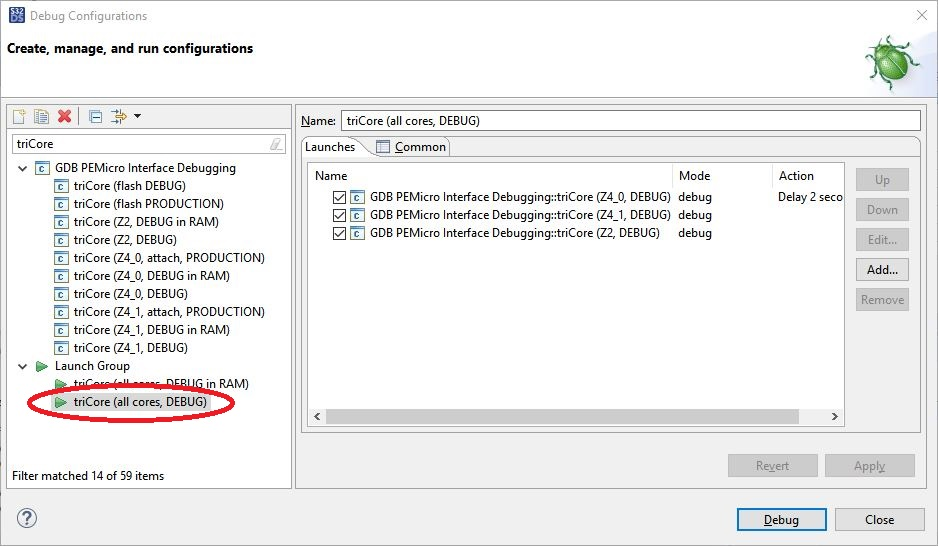

= image:doc/manual/theme/iconSafeRTOS-asColoredIcon.jpg[width="3%", pdfwidth="5%"] safe-RTOS (VLE) - A simple RTOS with safety support for MPC5748G
:Author:            Peter Vranken 
:Email:             mailto:Peter_Vranken@Yahoo.de
:toc:               left
:xrefstyle:         short
:numbered:
:icons:             font
:caution-caption:   :fire:
:important-caption: :exclamation:
:note-caption:      :paperclip:
:tip-caption:       :bulb:
:warning-caption:   :warning:

CAUTION: This readme file basically is a copy from the ancestor project,
which had been published for the MPC5643L. The text has not been fully
revised for the new context yet. It may still contain some references to
the single core solution for the MPC5643L.

== About this DEVKIT-MPC5748G sample

This DEVKIT-MPC5748G sample implements an easy to reuse RTOS
for the NXP MPC5748G and other microcontroller derivates with e200z4/7
core. The RTOS has been designed with respect to the demands of
safety-critical embedded software. The concept of processes has been
adopted with the intention of running applications of different
criticality levels in different processes without fearing harmful
interferences between them. Features of safe-RTOS are:

* Preemptive, priority controlled scheduling
* The kernel can run on any core, decided independently for each core
** Many basic services are available even on cores, which are not
   configured to run safe-RTOS. This relates to interrupt handling and
   synchronization
* Up to five processes (including kernel) with disjunct memory address
  spaces and hierarchic privileges
* Tasks belong to processes and share the process owned memories
* Processes are basically shared by the cores. The cores may run their
  tasks in same or in disjunct processes
* Communication services
** Secured priority ceiling protocol for inter-task communication on a
   core
** Inter-process function calls for communication between processes on a
   core
** Shared memory
*** Sharing between tasks of same process but running on different cores
*** Sharing between different processes
** Inter-core notification service for sending events and messages from
   core to core
** Inter-core mutex operations
* Hardware memory protection to ensure integrity of process owned memories
* Deadline monitoring and activation loss counters for avoidance of
  blocking tasks
* Exception handling to catch failures like use of privileged, illegal or
  misaligned instructions or forbidden access to memory or I/O
* Diagnostic API to gather information about failing processes and the
  possibility to halt critical processes
* I/O driver model for safe implementation of a complete operating system

The RTOS itself is not a runnable piece of software. It requires some
application code. The folder `code\application` contains several sample
applications for the RTOS. The build scripts take the name of a sample
application as an argument and link the selected application with the
RTOS into a flushable, runnable and debugable binary file.

To see how the samples work you need to open a terminal software on your
host machine. Look e.g. for a setup of "Putty" in the internet.

Open the serial port, which is offered by the DEVKIT-MPC5748G. (On
Windows, open the Computer Management and go to the Device Manager to find
out.) The Baud rate has been selected as 115200 Bd in function `main`, 8
Bit, no parity, 1 start and stop Bit. The terminal should print the
messages, which are regularly sent by the sample code running on the
evaluation board. Selected samples may even take some input.

== The RTOS

The proposed RTOS is little exciting with respect to its functionality.
The scheduler implements the functionality of what is called the "Basic
Conformance Class 1" (BCC1) of the OSEK/VDX-OS standard and of its BCC2 with
the exception of activation queuing.

The scheduler offers an API to create events that can activate tasks. An
event is either a regular timer event, triggered by the RTOS system clock,
a notification from another core or a software triggered event. The latter
can be triggered either from user code (if it has sufficient privileges)
or from ISRs belonging to the operating system.

The RTOS offers a pre-configured set of up to four processes. The
limitation to four is a hardware constraint and for sake of simplicity no
virtualization by software has been shaped.footnote:[
  With some limitation even more processes can be defined. The more
processes the more painful the limitations are. More than six processes
becomes unrealistic.]
  The operating system forms a fifth process. The operating system startup
code will register the needed tasks. The registration assigns them to one
of the processes and associates them with one of the created events.

All scheduling is strictly priority controlled. The triggering of an event
makes all associated tasks ready to run. This is called task activation.
At any time, the scheduler decides by priority, which of the _ready_ tasks
becomes the one and only _running_ task. This may involve preemption of
tasks.

The operating system startup code can install needed interrupt service
routines (ISR).

For mutual exclusion of tasks on a core, if shared data is involved, a
lock API is offered that implements the priority ceiling protocol (PCP).
It is secured so that supervisory tasks cannot be accidentally or
purposely blocked by application code.

The mechanisms already known from the other DEVKIT-MPC5748G sample
"startup" to suspend and resume all interrupts are still supported but
they are no longer offered to application code, only the operating system
may use them (mainly for I/O driver implementation).

The use of the RTOS is further supported by some diagnostic functions.
They offer stack usage information, information about caught exceptions
and averaged CPU load information. The diagnostics comes along with an
API to halt the execution of a process. Permission to use this API is
granted only to what is considered the safety process or task.

Many more details can be found in the manual, which is available
https://github.com/PeterVranken/DEVKIT-MPC5748G/blob/samples/safe-RTOS/doc/manual/readMe.adoc[online^]
in GitHub or as
https://github.com/PeterVranken/DEVKIT-MPC5748G/blob/samples/safe-RTOS/doc/manual/manual.pdf[printable^]
document. The API is described in the online https://htmlpreview.github.io/?https://raw.githubusercontent.com/PeterVranken/DEVKIT-MPC5748G/samples/safe-RTOS/doc/doxygen/html/globals_func.html[Doxygen help], too.

The architecture of the RTOS is very simple and resembles its ancestors,
which were the simple RTOS without safety concept and safe-RTOS-VLE with
hardware scheduler (still provided only for MPC5643L). This simplicity
significantly supports the validation of the code in a safety-critical
software development environment.

For an explanation of the scheduling scheme, you may still refer to the
documentation of the simple RTOS, please look
https://github.com/PeterVranken/TRK-USB-MPC5643L/tree/safe-RTOS-swScheduler/LSM/RTOS-VLE#The-RTOS[here (for MPC5643L)^].

== The safety concept

This sections aims at giving an overview on the safety concept. Technical
details can be found in the manual of the RTOS.

A typical nowadays embedded project consists of a lot of code coming from
various sources. There may be an Open Source Ethernet stack, an Open
Source Web server plus self-made Web services, there may be an Open Source
driver software for a high resolution LCD, a framework for GUIs plus a
self-designed GUI, there needs to be the self-made system control software,
possibly a file system for data logging on an SMD storage, the C
libraries are used, and so on. All in all many hundred thousand lines of
code.

If the system can reach a state, which is potentially harmful to people or
hardware, then it'll typically need some supervisory software, too, which
has the only aim of avoiding such a state. Most typical, the supervisory
software can be kept very lean. It may e.g. be sufficient to read a
temperature sensor, check the temperature against a boundary and to
control the coil of the main relay, which powers the system. If the
temperature exceeds a limit or if the temperature reading is somehow
implausible then the relay is switched off and the entire system
unpowered. That's all. A few hundred lines of code can already suffice
for such a task.

All the rest of the software is not safety relevant. A fault in this
majority of code may lead to wrong system behavior, customer
dissatisfaction, loss of money, frustration, etc. but will not endanger
the safety of the system or the people using it.

If we rate the safety goal higher than the rest then we have a significant
gain in terms of development effort if we can ensure that the few hundred
lines of supervisory code will surely work always well and even despite of
potential failures of the rest of the code. Without the constraint
"despite of" we had to ensure "working always well" for all the many
hundred thousand lines of code.

Using a safety-aware RTOS can be one means to ensure this. The supervisory
code is put into a process of higher privileges and the hundred thousands
of lines of other code are placed into a separate process with lower
privileges. (Only) RTOS and supervisory code need to be carefully
reviewed, tested, validated to guarantee the "working always well" of the
supervisory code. Using a "normal" RTOS, where a fault in any part of the
code can crash the entire software system, the effort for reviews, tests
and validation needed to be extended to all of the many hundred thousand
lines of code. The economic difference and the much higher risk of not
discovering a fault are evident.

These basic considerations result in a single top-level requirement for
our safe-RTOS:

* If the implementation of a task, which is meant the supervisory or
  safety task, is itself free of faults then the RTOS shall guarantee that
  this task is correctly and timely executed regardless of whatever
  imaginable failures are made by any other process.

This requirement serves at the same time as the definition of the term
"safe", when used in the context of this RTOS. safe-RTOS promises no more
than this requirement says. As a consequence, a software made with this
RTOS is not necessarily safe and even if it is then the system using that
software is still not necessarily safe. Here, we just deal with the tiny
contribution an operating system kernel can make to a safe system.

All other technical requirements are derived from this one.

=== Technical concept

The basic idea of safe-RTOS is to organize all user tasks in groups of
such, the processes. Each process has write-access to its own, disjunct
RAM areas. (And to one additional shared area, which all processes have
write access to.) Writing to any other address of the address space is a
privilege violation.

Reading RAM and ROM is known to be free of side-effects and can't do any
harm to another process -- it's therefore generally permitted.

Reading non-user MCU registers (CPU supervisor registers and I/O
registers) can have side-effects and is therefore generally forbidden. Any
attempt to do so is considered a privilege violation.

Any attempt to write to a non-user MCU register (CPU supervisor register
or I/O register) is considered a privilege violation.

API functions that control the behavior of other tasks or processes are
restricted to the use of certain processes. Any attempt of another process
to make use of such an API is a privilege violation. The most prominent
example is the API to halt the execution of a process.

Any privilege violation is punished by immediate abortion of the causing
task and in particular before the according instruction can have a
side-effect on not-owned RAM or CPU or I/O registers. The abortion is
counted with cause in the global process data.

The abortion of a task has no impact on future activations. The same task
will be activated again as soon as the event is triggered again, which the
task is associated with. If the task has a static error then it may easily
end up with an endless cycle of task activations and task abortions.

The kernel will never do more than immediately aborting a failing task.
It'll not take any decision like: "Enough is enough, we are going to stop
that." Instead, it offers the mechanisms to implement such decisions in a
particular supervisory task.

The implementation of recognizing privilege violations before they can
harm is founded on the memory management unit (MMU) in the CPU,footnote:[
  This holds in general but not for the MPC5748G, which doesn't have an
MMU. Here, memory protection is ensured only by the SMPU.]
  the memory protection unit of the CPU-external buses and the CPU's
exception mechanism. It's impossible for a user task to change the
behavior of the MPU as its registers are in the address space it itself
protects. It is impossible for user code to change the behavior of MMU or
CPU exception handling; these settings are held in CPU supervisor
registers, which cannot be accessed without an immediately punished
privilege violation.

Note, the execution of code in ROM is generally not restricted. A task may
even call operating system code routines -- until the executed code would
have a side-effect on not-owned RAM or on supervisor or I/O registers
(which it'll normally have very soon). Then a privilege violation is
detected and the task is aborted.

=== Self-diagnosis of the kernel

The RTOS offers an all-embracing concept for recognizing failures of the
user tasks and for hindering these failures from doing any harm. By
principle, the kernel can't offer such a concept for its own
implementation, too. Nonetheless, there is a thin layer of self-diagnosis
and protection against kernel implementation faults. The exception
handlers inspect the exception throwing context to prove that this context
belongs to the user task code. According to our concept this will always
be the case -- except for implementation errors in the kernel itself (or in
an added I/O driver, see below) or, less likely but possible, because of a
sporadic hardware fault, e.g. caused by local chip overtemperature or
cosmic radiation. In which case the kernel simply stops working on the core.

Halting the software execution can be considered not breaking the safety
concept of the system; in a safe system, there will always be an external
(i.e. CPU unrelated) device, which permanently checks the alive status of
the software running on the CPU and this device will ensure the transition
of the system into the safe state.

Note, in contrast to faults caught in the user tasks this mechanism can
not guarantee that the failure has not yet done some harm before being
recognized.

=== Kernel vs. Operating System

safe-RTOS implements an operating system kernel but not an operating
system (OS). Additional code has to be added to let it become an OS. The
majority of this code will be the configuration and setup of processes and
tasks and a set of I/O device drivers.

The implementation of such drivers needs to make use of privileged
instructions and needs to access the I/O address space, which both is not
allowed in user tasks. The safety concept can hence not be limited to the
RTOS. The considerations made for the RTOS and its implementation need to
be considered for the I/O driver implementation, too. The concept is that
the RTOS is not limited to the source code that implements it but it also
has an abstract layer: It comes along with a binding set of design rules
how to implement an I/O driver. These rules are called the "driver model".
Any programmer of an I/O driver, who disregards only a single rule will
break the entire safety concept and the RTOS implementation can't help it.

safe-RTOS's driver model specifies memory mapped drivers, safe callbacks
and system calls of three "conformance classes", basic, simple and full.
They offer a trade off between driver performance in terms of CPU load and
attainable behavior and ease of programming. The by far leanest and most
powerful "basic" implementation needs to be done in assembler, the other
two classes can be implemented in C.

Note, adding an I/O driver to the RTOS is not only a matter of complying
with the driver model. Any programming error can potentially break the
safety concept, too. Much of the I/O driver code is executed in the kernel
process and implementation faults can crash the entire software system
like it generally is for all code in a "normal" RTOS. The organization of
the development work needs to take care by planning and implementing
according quality assurance measures. (Organizational measures, which will
necessarily include the published source code of the RTOS itself.)

=== Architecture of application code

Provided all I/O drivers are implemented fully compliant with the driver
model and they have been successfully validated then we have a safe
operating system but still not a safe software. A further constraint is
that the application software makes correct use of the offered mechanisms.

The supervisory code shall be put into the process with highest
privileges. It can be that the outlined concept is implemented in a
recursive way and the supervisory code is in turn split into two
criticality levels, with a very lean watchdog functionality on top.
("Sub-ordinated main part of supervisory code still alive and
functioning?") In which case the watchdog would have highest privileges
followed by the main part of the supervisory code and both having higher
privileges as the supervised functional code.

The highest privileged safety code will run on a priority level, which cannot
be preempted by tasks belonging to processes of lower privileges and which
cannot be blocked by these tasks using the offered APIs for mutual
exclusion of tasks. (With other words, a task with low privileges cannot
shape a critical section with the task of highest privileges.)

The supervisory code will make use of the diagnostics APIs to see if the
functional code is executing well. It can in case halt the execution of
the failing process or otherwise ensure that the system doesn't leave the
safe operation state.

The RTOS mechanisms guarantee that faults in the user code cannot do any
harm -- but this relates only to the definition of "harm" in the RTOS
context: OS configuration, I/O configuration or state, memory of other
processes, timely execution of their tasks can't be touched. The same
mechanisms can not hinder the user task code from doing all kind of
things, which are not harmful in this sense but still harmful to the
system under control. Not allowing this is of course a top-level
requirement of the aimed software. It needs to be tackled mainly by the
architecture of the software. Here's a single example:

Commonly, the functional code in the software computes I/O commands, which
go to the I/O drivers and control the connected actuators -- which can mean
a lot of harm if giving wrong commands. By application design it can be
easily ensured that a functional task runs first, followed by a
supervisory task and finally the OS owned I/O driver task executes. In
such an architecture the supervisory code would be put in the position to
double-check the I/O control commands -- and override them if advisable --
before these commands are executed by the finally running I/O task.

This is just meant a simple example. The point is that the RTOS only
offers the mechanisms to design a safe software but it can not undertake
for software safety.

== Tools

=== Environment

==== Command line based build

The makefiles and related scripts require a few settings of the
environment in the host machine. In particular, the location of the GNU
compiler installation needs to be known and the PATH variable needs to
contain the paths to the required tools. 

For Windows users there is a shortcut to PowerShell in the root of this
GitHub project, which opens the shell with the prepared environment.
Furthermore, it creates an alias to the appropriate GNU make executable.
You can simply type `make` from any location to run MinGW32 GNU make.

The PowerShell process reads the script `setEnv.ps1`, located in the
project root, too, to configure the environment. This script requires
customization prior to its first use. Windows users open it in a text
editor and follow the given instructions that are marked by TODO tags.
Mainly, it's about specifying the installation directory of GCC.

Non-Windows users will read this script to see, which (few) environmental
settings are needed to successfully run the build and prepare an according
script for their native shell.

[[secOpenEclipse]]
==== Eclipse for building, flashing and debugging

Flashing and debugging is always done using the NXP S32 Design Studio for
Power Architecture, an Eclipse IDE, which is available for free download
und unrestricted use in commercial and non commercial projects.

If you are going to run the application build from the Eclipse IDE then
the same environmental settings as described above for a shell based build
need to be done for Eclipse, too. The easiest way to do so is starting
Eclipse from a shell, that has executed the script `setEnv.ps1` prior to
opening Eclipse.

For Windows users the script `S32DS-IDE.ps1` has been prepared. This script
requires customization prior to its first use. Windows users open it in a
text editor and follow the given instructions that are marked by TODO
tags. Mainly, it's about specifying the installation directory of
the S32 Design Studio.

Non-Windows users will read this script to see, which (few) environmental
and path settings are needed to successfully run the build under control
of Eclipse and prepare an according script for their native shell.

Once everything is prepared, the S32 Design Studio will never be started
other than by clicking the script `S32DS-IDE.ps1` or its equivalent on
non-Windows hosts.

See https://github.com/PeterVranken/TRK-USB-MPC5643L[project overview^] and
https://github.com/PeterVranken/TRK-USB-MPC5643L/wiki/Tools-and-Installation[GitHub
Wiki^] for more details about downloading and installing the required
tools.

=== Compiler and makefile

Compilation and linkage are makefile controlled. The compiler is GCC
(MinGW-powerpc-eabivle-4.9.4). The compiler is part of the S32 Design
Studio installation and can be used independently from the Studio. The
makefile is made generic and can be reused for true, large projects that
want to make use of safe-RTOS. It supports a number of options (targets);
get an overview by typing:
 
    cd <projectRoot>/samples/safe-RTOS
    mingw32-make help

The main makefile `GNUmakefile` has been configured for the build of
sample "safe-RTOS" but the kernel can't be linked into a runnable
binary without an application. You need to specify the source code path of
a safe-RTOS application on the command line of make. Set variable APP to
do so. Possible applications can be found as the children of folder
`<projectRoot>/samples/safe-RTOS/code/application`. Type
("code/application/default/" is just an example):

    mingw32-make -sO build APP=code/application/default/
    mingw32-make -sO build APP=code/application/default/ CONFIG=PRODUCTION

to produce the flashable files
`bin\ppc\default\DEBUG\DEVKIT-MPC5748G-safe-RTOS.elf`, and
`bin\ppc\default\PRODUCTION\DEVKIT-MPC5748G-safe-RTOS.elf`.

To get more information, type:

    mingw32-make --help
    mingw32-make help

WARNING: The makefile requires the MinGW port of the make processor. The
Cygwin port will fail with obscure, misleading error messages. For your
convenience, we have uplodaded an appropriate recent version of the MinGW
make processor into this GitHub project. The PowerShell startup script
aliases this (Windows) executable to the command `make`. Moreover,
explicitly typing `mingw32-make` will generally avoid any problem.

The makefile is designed to run on different host systems but has been
tested with Windows 7 and Windows 10 only.

Note, the Eclipse project configuration in the root folder of this
DEVKIT-MPC5748G sample (`.settings`, `.cproject`, `.project`) only
supports the build of a sub-set of the possible configurations. safe-RTOS
can be compiled with a few sample applications only, each of them in DEBUG
and PRODUCTION compilation. To build more samples with Eclipse you would
have to duplicate the existing build configurations and adapt the make
command lines in the build settings according to the explanations and
examples above.

[[secRunInRAM]]
=== Running your application in RAM

The makefile and the linker scripts support the location of the code
entirely in RAM. The MPC5748G has plenty of RAM so that even large pieces
of code can be loaded and executed in RAM. This is extremely helpful for
code development. Loading the code into the device's RAM is significantly faster
than into ROM and many flash erase and program cycles can be saved. Even
if your complete project may not fit into RAM then you may still consider
it useful to build some sub-modules together with their testing code in
this way.

Nothing particular has to be done to load a compiled software into RAM.
The GNU debugger in the Design Studio just looks at the addresses of code
and data objects in the binary file (`*.elf`). It'll erase and flash the
ROM if the objects have ROM addresses and it'll load them into RAM if the
objects are located in RAM. So all we have to do is defining the memory
addresses in the linker scripts accordingly in the one or the other way.

Under control of a macro in the main makefile, `GNUmakefile`, the linker
chooses different address ranges. If the macro `LINK_IN_RAM` is element of
the list of macros then the linker will divide the physically available
RAM into 67% for code or text and constant data sections (512k) and 33%
for data sections (256k). If the macro is not defined in the list then all
768k of RAM are available to the data sections.

The macro is seen by the C source code at compile-time, too. However,
there are barely dependencies. The MPU configuration is the principal
exception and some execution timing operations are dependent on the macro,
too.

To switch between linkage in ROM or RAM, open file `GNUmakefile` in a text
editor and look for the definition of variable `defineList`. The left hand
side expression is a blank-separated list of symbols, which are passed to
the compiler and linker as preprocessor #define. Add `LINK_IN_RAM` if
you want to run your code in RAM.

CAUTION: Running the software in RAM is useful but, by principle, a
preliminary, temporary way of working only. Running the software can be done
only under control of the debugger, which is needed to load the binary
data into the MCU's RAM. A start of the software out of reset or after a
power-up or without connected Design Studio is impossible.

=== Flashing and debugging

The code of this DEVKIT-MPC5748G sample can be flashed and debugged with
the S32 Design Studio IDE. Effectively, flashing means to start the GNU
debugger (GDB) and to let it "load" the *.elf file. If the code is linked
in flash ROM address space then this loading means writing to the flash.
Consequently, a flash configuration in the Eclipse IDE is nearly identical
to any ordinary debug configuration, just the option "Load executable" to
load a file is checked. Normal debug configurations, i.e. for debugging,
don't have this check mark set:

[[figDebugConfigFlash]]
.Eclipse debug configuration, which is used for flashing
image::readMe_resources/debugConfigForFlashing.jpg[Eclipse debug configuration, which is used for flashing, width="70%", pdfwidth="70%", align="center"]

Connect your evaluation board DEVKIT-MPC5748G with the USB wire and start
the S32 Design Studio as outlined above (<<secOpenEclipse>>). Now you can
find the debug configuration shown in <<figDebugConfigFlash>> in menu
"Run/Debug Configurations..." A dialog listing all available debug
configurations opens. Type "flash" in the text box, which initially has
the focus, to filter all of them, which are intended for flashing and
select the one you need. Press the Enter key or click on button
"Debug" and the flash process begins. The progress is printed in one of
the console windows in the lower right corner.

It's a bit counter-intuitive that flashing with GDB is just a kind of side
effect of starting the debugger. Rather than with a "Congratulations,
flashing successfully completed"-message, flashing ends with a ready to
use interactive debug session: The source code window shows the startup
code for the boot core Z4A and you could go ahead and step through the
just flashed code. However, you won't typically do so and rather stop this
debug session again. This is why:

In the S32 Design Studio, a debug session for projects running _n_ cores
requires opening a combination of _n_ Eclipse debug configurations, one
for each core. Such a combination is called a "Launch Group". Our flash
configurations generally use only a single debug configuration, because
our project links all the code in one *.elf file, regardless of the number
of cores, which are in use. Therefore, if you'd really go ahead with the
flash debug session then you could only control and observe boot core Z4A.
Better to close it again and start a more appropriate Launch Group, like
"triCore (all cores, DEBUG)".

[[figLaunchGroup]]
.Debug configuration to chose when debugging a multi-core software

If you built your software for execution in RAM (see <<secRunInRAM>>) then
you don't need to flash. No matter what is currently flashed, just start
the according debug configuration. The RAM is loaded with your software
and you can start it with the usual debugger commands to step and run,
etc. If you end the debug session while the cores are all running (i.e.
none of the cores is halted in a breakpoint) then the software in RAM even
stays alive and can be observed without debugger connection. Only after
next reset the ROM software will take effect again.

By the way, the debug sessions can be found also by a click on the black
triangle next to the blue icon "bug". The last recently used
configurations are listed in the menu. To see all of them or to
double-check their properties you'd click "Debug Configurations...",
somewhere down below the list. In the new dialog, select the wanted one
and start the debugger with a last click on button "Debug".

== Code architecture

=== Book E versus VLE

Only VLE code is supported.

== Known issues

. Debugger: If the view shows the INTC0 register set then the debugger
harmfully affects program execution and the RTOS fails: The write to
INTC_EOIR_PRC0, which normally restores the current priority level
INTC_CPR_PRC0, now fails to do so. The complete interrupt handling fails
from now on. Mostly the effect is that the OS tick interrupt, which has a
high priority, leaves this high priority level set in the INTC_CPR_PRC0,
so that effectively no interrupts (including itself) are handled any more.
Only the code of the idle task is executed any longer.
+
Workaround: Don't open the view of the INTC0 in the debugger when
debugging a safe-RTOS application. Then the INTC and the code work fine.

. Debugger: A similar effect has been observed with the instructions to
alter the External Interrupt enable bit, MSR[EE]. Do not single-step in
the debugger over wrtee(i) instructions. The instruction may fail to
change the bit. If the code approaches such an instruction you should use
the right-click operation "Run to line", targeting the instruction behind
the wrtee(i). This works fine.

. Debugger: A similar effect has been observed when putting a breakpoint
on the first instruction of an exception handler. (Which is indeed a
natural desire to be informed about exceptions.) The correct exception
handling is confused. The CPU state is not correctly stored in the xSRRi
registers and the MSR bits are not properly updated, at least not the
External Interrupt enable bit, MSR[EE]. Further software execution has
barely a chance. Workaround is to set the breakpoint a few instructions
further on in the exception handler.

. Debugger: It is not possible to hinder the P&E debugger from halting at
an se_illegal instruction. (See https://community.nxp.com/thread/497533)
This makes it impossible to debug the fault catching capabilities of the
RTOS. All severe code errors, which lead to the execution of an arbitrary
address, will sooner or later encounter a zero word in the instruction
stream and the debugger will break -- before the RTOS can catch the error.
It is possible to continue the code execution from the debugger and to
see, what the RTOS will do but this is an interactive process and
systematic testing of error catching code is not possible this way. We can
only do it without connected debugger.